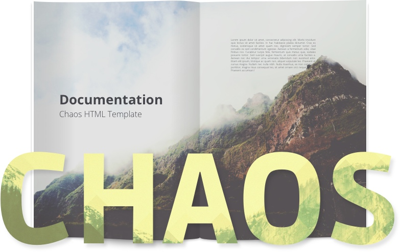

# Welcome

## Welcome

Thank you for purchasing _CHAOS - Academic Driven Multipurpose Template_. This documentation will help you get familiar with theme and its features.

### Whom is this for?

This file is for who has purchased the template from Themeforest marketplace and wants to get familiar with the features of the template. Normally HTML templates like the current item is used by other developers who want to integrate it with their own software or CMS, but there are always novice people who want to use this as their own website. Reading this documentation needs intermediate knowledge of HTML and CSS. You should be able to read and understand HTML files and follow the CSS files to get the idea of how things work and how to customize them.

### How to use this documentation?

Anyone can use this page as a reference to find features and sample codes of the templates. Also there is a HOW TO section that you can find frequently asked questions.

Please note that you should read the HTML code to fully understand the it, but having this page as a guide will be useful for you. Please don't rely on this page if you want to fully understand how things work and try them out for yourself.

### How to get support?

If you found yourself in a situation that you needed more advanced explanations or any other concept which is beyond this documentation file, don't hesitate to contact our support staff by sending an email to [owwwlab@gmail.com](mailto:owwwlab@gmail.com)

### How to update?

We release updates free of charge. There will regularly be some bug fixes, but you should read the changes and implement them to your code manually. Updates will be released within Themeforest and you can be notified by following us at twitter [@owwwlab](https://twitter.com/owwwlab)

