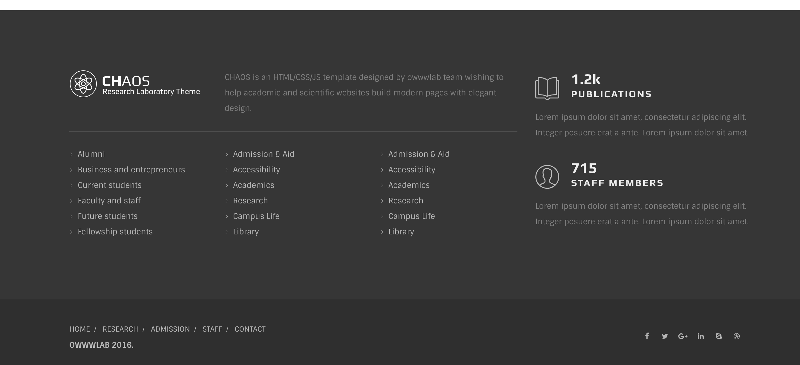

# Footers

Footer is the last visible block of the page and it has two important section. Footer main area and footer bottom bar.

Here is the markup for one of Chaos main footers:

```text
<footer id="footer" class="dark-wrapper">
    <div id="footer-main">
        <!-- -Main Content for footer-->
    </div>
    <div id="footer-bar">
        <!-- ----Mostly used for copyrights, messages and social icons-->
    </div>
</footer>
```



Inside the `.footer-main` element, you can place the footer content which is usually a logo with some widgets. footer-bar arear however must be used for small amount of contents like copyright message or social icons.

