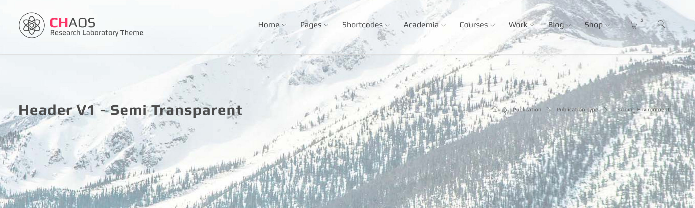
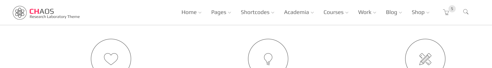
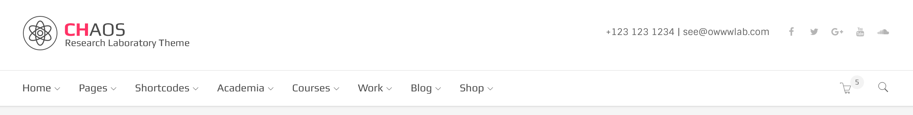

# Headers

Header is represented by "header" tag and "header" id. It has different variations for size, color, background and etc which can be added by assigning the related helper class.

Please scroll down to see the manual for all available variations but if you are just looking for a specific class, we have summerized important ones in following table. They all should be added to the header tag unless a different tag is mentioned in description.

| Class | Description |
| :--- | :--- |
| .dark | define header as an area with dark background Add this class if the header has a dark background of any kind \( image, color,...\) . It will set a light color for contents inside the dark header |
| .sticky-light | define sticky header as a area with light background |
| .sticky-dark | define sticky header as a area with dark background |
| .trans | header with transparent background |
| .semi-trans-light-percentage | transparent header with a light overlay. e.g: .semi-trans-light-20 |
| .semi-trans-dark-percentage | transparent header with a light overlay. e.g: .semi-trans-dark-20 |
| .fullwidth | remove the container wrapper and make header fullwidth |
| .thick | for ticker header |
| .thin | for narrow header |
| .side-header | create a vertical header instead of default horizontal one. It Should be added to the body tag |
| .sticky-header | adds sticky header effect. It Should be added to the body tag |

## Default variation

Headers can be different in size, layout and background type and whetere or not it should be sticky. The basic header layout screenshot and markup is:


Markup:

```text
<header id="header"> 
<!-- -----Begin header main area-->
    <div class="head-main">
      <div class="container">
        <div class="logo-wrapper">
             <!-- -----Logo Markup-->
        </div>
        <ul id="primary-menu">
             <!-- -----Menu Markup-->
        </ul>
        <div class="header-icons">
            <!-- -----Icons Markup-->
        </div>
    </div>
</header>
```

Everything in `.head-main` is aligned to the right, except the logo wrapper. `.header-icons` is a wrapper that will be placed at the right side of the header and can contain related icons like search, humbergur menu and etc.

## Color Variations

By default the header has a light background color. There is also a dark version available by adding the class `.dark` to header tag. The dark class gives a dark color to header background and also a light color to all elements inside it.


The Markup should be as follow:

```text
<header id="header" class="dark"> 
    <!-- -----Header Markup-->
</header>
```

**Note:** If the background of header is dark \(by a background image, color , pattern or being transparent\) you must add class `.dark` to header tag so the contents inside it get proper color.

## Size Variations

There are three main different sizes available for header. Beside default size, two `.thin` and `.thick` classes can be assigned to header to make it narrower or taller.

Here is an screenshot of thick version with `.dark` class to make it more clear:


## Layout Variations

By default the header contents are wrapped inside a container, you can ommit this by adding class `.fullwidth`.

## Background Variations

As we already saw, header can have light and dark background color but beside that there are three major transparency classes as well. `.trans`, `.semi-trans-light-percentage` and `.semi-trans-dark-percentage`. The main point is to make header background transparent so we can see the element behind it which is mostly a background image.

`.trans` is fully transparent and the other two classes are also transparent but with a light or dark overlay. The level of darkness or lightness overlay is controlled by the percentage part which is a number between 10 to 90.

For example header with `.semi-trans-light-20` would look like this:



And the markup would be as follow:

```text
<header id="header" class="semi-trans-light-20"> 
    <!-- -----Header Markup-->
</header>
```

## Sticky Variations

By adding class `.sticky-header` to the `body` tag, the header will be sticky and always visible to the user.

However the header would be non-sticky in mobile devices regardless of the class in order to achive a better user experience.

## Sticky color variation

By default the sticky header color scheme would be same as the header itself but if you want to make it different, you can assign `.sticky-light' or`.sticky-dark' classes to it. For example if the header is dark but you want to make it light in sticky version, add `.dark .sticky-light` classes.

Here is the markup:

```text
<header id="header" class="trans dark sticky-light"> 
    <!-- -----Header Markup-->
</header>
```

Default dark header : 

Sticky light variation: 

## Header V2

Header V2 is a variation of the header which has two level, one with logo and the other with navigation menu. It is suitable for large number of menu items or more informative headers.

 Here is the markup:

```text
<header id="header"> 
    <div class="head-main text-right hidden-sticky">
      <div class="container">
        <div class="logo-wrapper">
             <!--Logo wrapper markup-->
        </div>
        <div class="promotion">
             <!--Any slogan or information block for the right side-->
        </div>
      </div>
    </div>
    <div class="nav-row">
      <div class="container">
        <div class="visible-sticky">
          <div class="logo-wrapper">
            <!--Logo which is only visible in sticky mode-->
          </div>
        </div>
        <ul id="primary-menu">
            <!--Menu markup-->
        </ul>
        <div class="header-icons">
            <!--Any Icons for right side of second level-->
        </div>
      </div>
</div>
</header>
```

## Side header


You can achieve this effect by adding "side-header" class to the body of the default version of the header. **Note**  
 You can't use it with header V2

