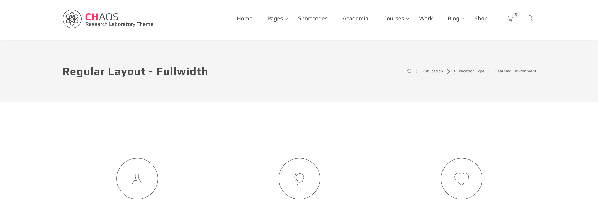
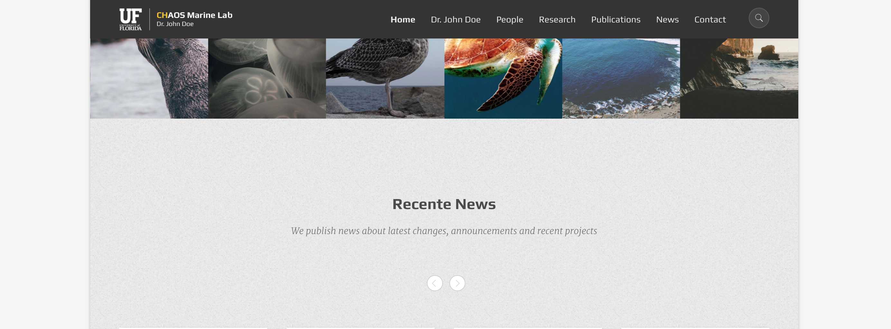
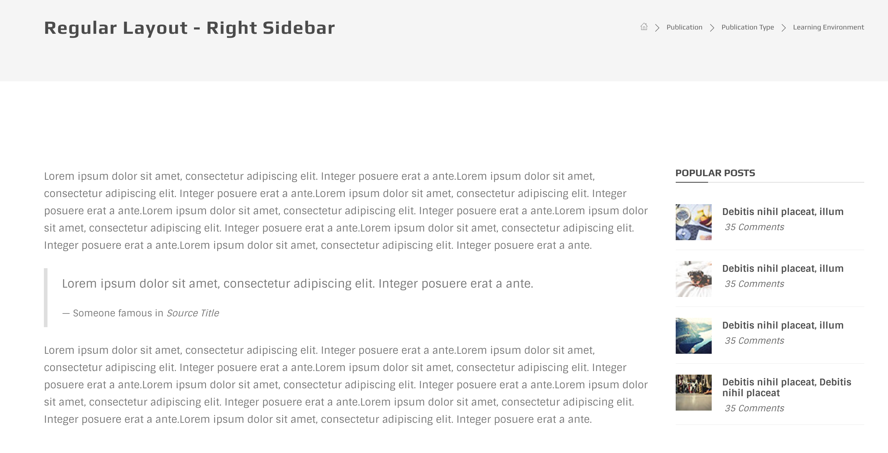

# Layouts

There are three major layout type available in Chaos. Regular, boxed and side header. Each has it's own variations like wheter or not it should be fullwidth, the position and number of available sidebars and etc.

## Regular Layout

Regular is the main layout for Chaos and by default it's fullwidth and elements inside it can extend tto left and right side of the browser available area. However mostly the content inside is getting wrapped inside a bootstrap container element that has fixed width.

### markup

You cans see Chaos default page structure in following code snippet:

```text
<body class="fullwidth">
    <div id="wrapper" class="regular-layout">
        <header id="header">
        <!-- ----- Header markup-->
        </header>
        <section id="contents">
        <!-- ----- Page Main area -->
        </section>
        <footer id="footer" class="dark-wrapper">
        <!-- ----- Footer markup-->
        </footer>
    </div>
    <div id="scripts">
    <!-- ----- Include JS files and inline scripts-->
    </div>
</body>
```

### screenshot



Layout variations are determined by using helper classes on "body" and "\#wrapper" elements. Here we have `.regular-layout` class on body tag.

## Boxed Layout

Boxed layout is same as regular except all elements like sections, backgrounds, ... are wrapped inside the boostrap container. You can see a real case of this layout in our demo4



## Sidebars

Sidebars in Chaos are made via bootstrap columns grid system. They are nothing more than div with a simple `.col-*` class. Following snippet shows the markup for a layout with sidebar on the right side:

```text
<section id="contents">
    <div class="page-head">
        <!-- Page head usually for hero, sliders or page titles-->
    </div>
    <div class="page-contents">
      <section class="section">
        <div class="container">
          <div class="row">
            <div class="col-md-9">
              <div id="main-area">
                <!-- -----Main area of a page with sidebar-->
              </div>
            </div>
            <div class="col-md-3">
              <div class="sidebar right">
                <!-- -----Sidebar markup-->
              </div>
            </div>
          </div>
        </div>
      </section>
    </div>
</section>
```

### screenshot



Another example for a page for left sidebar would be:

```text
<div class="page-contents">
  <section class="section">
    <div class="container">
      <div class="row">
        <div class="col-md-9 col-md-push-3">
          <div id="main-area">
            <!-- -----Main area of a page with sidebar-->
          </div>
        </div>
        <div class="col-md-3 col-md-pull-9">
          <div class="sidebar left">
            <!-- -----Sidebar markup-->
          </div>
        </div>
      </div>
    </div>
  </section>
</div>
```

Here we are using bootstrap `.push` and `.pull` classes to correctly place the area wrappers.

## Layout Side header

This layout is totally different rather than the other two. It has a vertical header which we call it "Side Header". The only thing you need to do to get this layout is adding class `.side-header` to the body tag.

