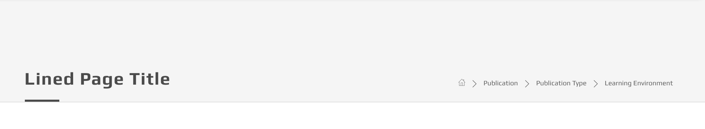
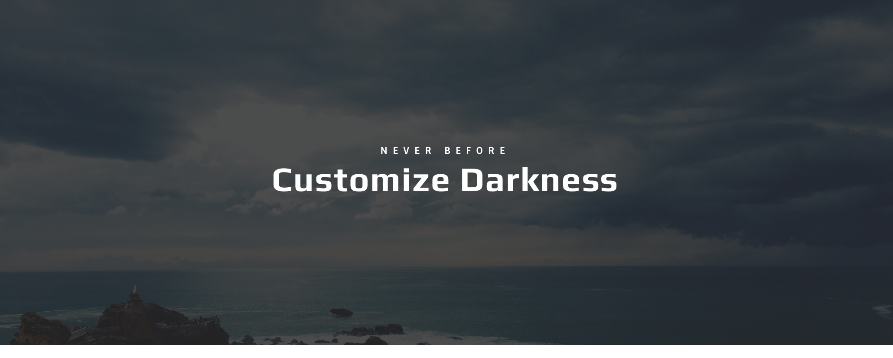
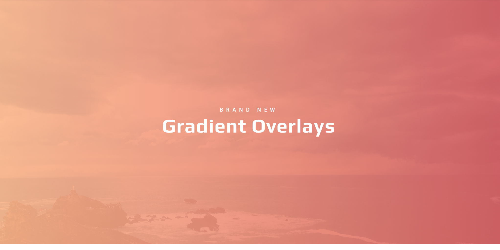
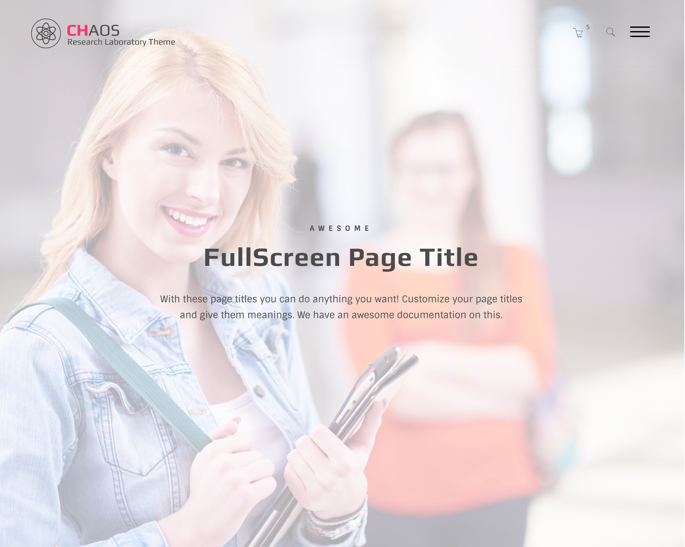
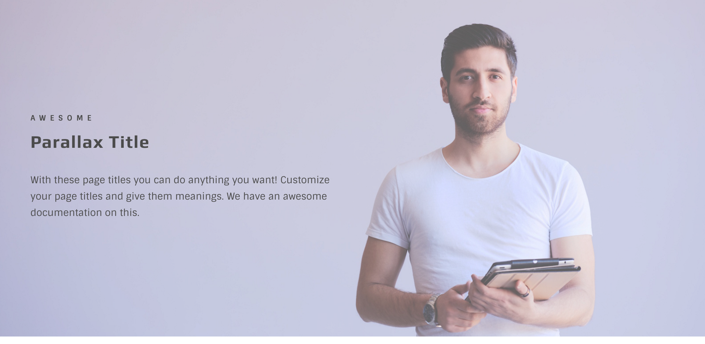

# Page Titles

## Default page title


The default markup for a typical page title:

```text
<div class="page-head">
  <div class="container">
    <div class="tb-vcenter-wrapper">
      <div class="title-wrapper vcenter">
        <h1 class="title">Default page title</h1>
      </div>
      <div class="breadcrumb-wrapper vcenter">
        // breadcrumbs
      </div>
    </div>
  </div>
</div>
```

And the HTML for the breadcrumbs is:

```text
<ul class="breadcrumb">
  <li><a href="#"><i class="oli oli-home"></i></a></li>
  <li><a href="#">publication</a></li>
  <li><a href="#">publication type</a></li>
  <li>learning environment</li>
</ul>
```

In the above code, `.vcenter` class stands to vertically centered, meaning that the two elements with this class will be vertically aligned inside their wrapper which is `.tb-vcenter-wrapper` element.

In addition to `<h1 class="title">Default page title</h1>`, there can be two additional information inside the `.title-wrapper` element. A complete one will be:

```text
<div class="title-wrapper vcenter">
  <h4 class="head">Before title</h4>
  <h1 class="title">Page Title</h1>
  <h2 class="description">Some description about the page</h2>
</div>
```

#### Height

The heigh of page title by default is 150px. You can add some assets classes to specify it's height \(i.e `.h-500`, `.h-700`\) or if you want to use a Revolution slider inside, then you should add `.auto-height` class.

```text
/// height auto (the content will set the height)
<div class="page-head auto-height">...</div>
```

```text
/// 500px height
<div class="page-head h-500">...</div>
```

```text
/// fullscreen
<div class="page-head hvh-100">...</div>
```

#### Background image

Add `.set-bg` class along with `data-img-src` attibute.

```text
<div class="page-head set-bg" data-img-src="../../assets/img/backgrounds/02.jpg"></div>
```

#### Parallax

Instead of `.set-bg` you should use `.parallax-layer` class. This will make your background image to act like a parallax background image.

#### Overlay

Adding `.ov-*` classes to the page-head will add specified overlay on your background image. This can be useful to make contrast between text and image.

#### Alignment

Addidn `.center-it` class will brign the title contents to center. Also it will hide the breadcrumbs, if any.

#### Dark & Light

This asset class \(`.dark`\) will make texts white, so you can use dark background images or overlays without worrying about the contrast.

### Code snippets

 **Note** to the `.lined` class here

```text
<div class="page-head lined set-bg" data-img-src="../../assets/img/tiny_grid.png">
  <div class="container">
    <div class="tb-vcenter-wrapper">
      <div class="title-wrapper vcenter">
        <h1 class="title">Lined page title</h1>
      </div>
      <div class="breadcrumb-wrapper vcenter">
        ...
      </div>
    </div>
  </div>
</div>
```



```text
<div class="page-head set-bg h-400 center-it ov-dark-alpha-80 dark" data-img-src="../../assets/img/backgrounds/04.jpg">
  <div class="container">
    <div class="tb-vcenter-wrapper">
      <div class="title-wrapper vcenter">
        <h4 class="head">Never Before</h4>
        <h1 class="title">Customize Darkness</h1>
      </div>
    </div>
  </div>
</div>
```



```text
<div class="page-head set-bg h-500 center-it ov-grad2-alpha-90 dark" data-img-src="../../assets/img/backgrounds/04.jpg">
  <div class="container">
    <div class="tb-vcenter-wrapper">
      <div class="title-wrapper vcenter">
        <h4 class="head">Brand New</h4>
        <h1 class="title">Gradient Overlays</h1>
      </div>
    </div>
  </div>
</div>
```

 This is a fullscreen page title

```text
<div class="page-head set-bg hvh-100 center-it ov-light-alpha-60" data-img-src="../../assets/img/backgrounds/02.jpg">
  <div class="container">
    <div class="tb-vcenter-wrapper">
      <div class="title-wrapper vcenter">
        <h4 class="head">Awesome</h4>
        <h1 class="title">FullScreen Page Title</h1>
        <h2 class="description">With these page titles you ca...</h2>
      </div>
    </div>
  </div>
</div>
```

 In this example we have used `.parallax-layer` class on `.title-wrapper` with `data-parallax-mode="mode-header-content"`

```text
<div class="page-head hvh-60 set-bg ov-light-alpha-20" data-img-src="../../assets/img/backgrounds/05.jpg">
  <div class="container">
    <div class="tb-vcenter-wrapper">
      <div class="title-wrapper vcenter parallax-layer" data-parallax-mode="mode-header-content">
        <h4 class="head">Awesome</h4>
        <h1 class="title">Parallax Title</h1>
        <h2 class="description">With these page titles you can do anything you want! Customize your page titles and give them meanings. We have an awesome documentation on this.</h2>
      </div>
    </div>
  </div>
</div>
```

Another variation to parallax content by adding `data-parallax-mode="mode-title"` to page-head.

```text
<div class="page-head hvh-60 ov-light-alpha-20 parallax-layer" data-img-src="../../assets/img/backgrounds/05.jpg" data-parallax-mode="mode-title">
  <div class="container">
    <div class="tb-vcenter-wrapper">
      <div class="title-wrapper vcenter parallax-layer" data-parallax-mode="mode-header-content">
        <h4 class="head">Awesome</h4>
        <h1 class="title">Parallax Background &amp; Title</h1>
        <h2 class="description">With these page titles you can do anything you want! Customize your page titles and give them meanings. We have an awesome documentation on this.</h2>
      </div>
    </div>
  </div>
</div>
```

