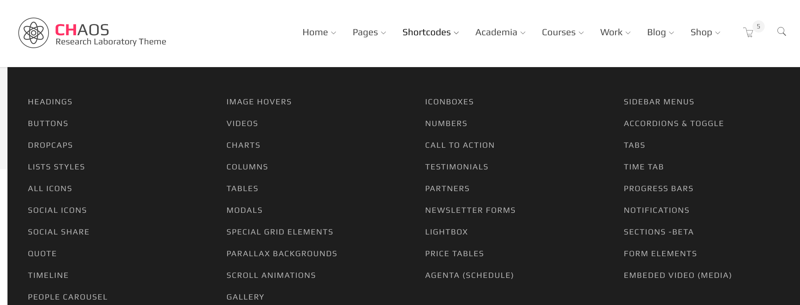

# Primary Menu

Chaos menu is built using the WordPress menu logic. It has identical classes and markup. The classes are self-descriptive as you can see in following snippet:

```text
<ul id="primary-menu">
  <li class="menu-item-has-children">
    <a href="target" title="Home"><span>Home</span></a>
    <ul class="sub-menu">
      <li>
        <a href="target" title="Home #1"><span>sub menu 1</span></a>
      </li>
      <li>
        <a href="target" title="Home #1"><span>sub menu 2</span></a>
      </li>
    </ul>
  </li>
  <li class="menu-item-has-children">
    <a href="target" title="Pages"><span>Pages</span></a>
  </li>
  <li class="mega-menu menu-item-has-children">
    <a href="target" title="Shortcodes"><span>Shortcodes</span></a>
    <!-- -----Mega menu markup-->
  </li>
</ul>
```

The classes that can be applied to each li elements are listed in followin table:

| Class | Description |
| :--- | :--- |
| .current-menu | currently active menu |
| .current-menu-parent | parent node of current active menu |
| .menu-item-has-children | menu item has submenu |
| .mega-menu | mega-menu wrapper |

## Mega menu

Mega menu is a fullwidth wrapper that can contain pretty much any type of content as a menu. Inside it there is stil a `ul` element with `li` childs but this lists items can be used as bootstrap normal columns that can contain any HTML markup like an image or just a normal list.



**Important:** Mega menu as a fullwidth wrapper is only for large screens and desktops. In mobile devices the only thing that remains visible inside a mega menu is `ul` list with class `.nav-ul`. So if you have a mega menu that contains navigation links along side of other contents, make sure the navigation `ul` has \`.nav-ul' class.

Here is a sample markup for a mega menu item:

```text
<ul class="megamenu-wrapper sub-menu ">
  <li class="col-md-3">
    <!-- -----First column markup-->
    <ul class="nav-ul">
      <li><a href="target">sub link 1</a></li>
      <li><a href="target">sub link 2</a></li>
    </ul>
  </li>
  <li class="col-md-3">
     <!-- -----Second column markup-->
  </li>
  <li class="col-md-3">
    <!-- -----Third column markup-->
  </li>
   <li class="col-md-3">
    <!-- -----Last column markup-->
  </li>
</ul>
```

