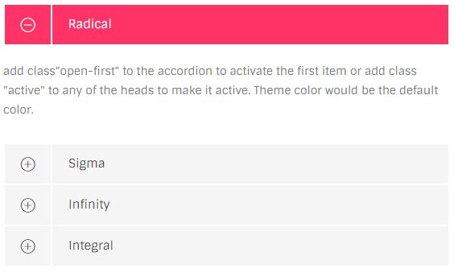
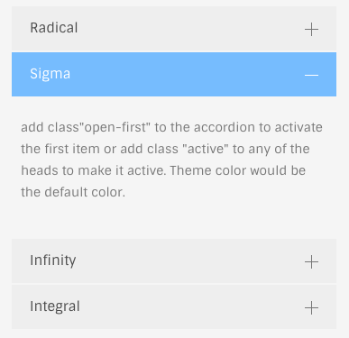

# accordions & toggles

## Accordions



### HTML

```text
<div class="ol-accordion">
  /// accordion items
</div>
```

markyo for an accordion item:

```text
<div class="ac-item">
    <div class="item-head">
      <span>--title--</span>
    </div>
    <div class="item-body">
        --contents--
    </div>
</div>
```

### Open when page loads

By default the very first item will be open at page load, but it can be altered by adding `.open` class to one of accordion items, that item will be oppend when the page is loaded, instead of the first item:

`<div class="ac-item open">...</div>`

### Skins

You can choose from 6 color variations by adding these classes to the element.

* `.red-skin`
* `.green-skin`
* `.cyan-skin`
* `.yellow-skin`
* `.dark-skin`
* `.blue-skin`

eg.

```text
<div class="ol-accordion red-skin">...</div>
```

## Toggles

Toggles naturally are accordions but the behavior is slightly different. A toggle can be open or close, regardless of other siblings.



### HTML

```text
<div class="ol-accordion toggle-free">
   /// toggle items
</div>
```

Note that the only difference is the additional `.toggle-free` class.

And a sinlge toggle item would the same as accordion:

```text
<div class="ac-item">
    <div class="item-head">
      <span>--title--</span>
    </div>
    <div class="item-body">
        --contents--
    </div>
</div>
```

### Skins

You can choose from 6 color variations by adding these classes to the element.

* `.red-skin`
* `.green-skin`
* `.cyan-skin`
* `.yellow-skin`
* `.dark-skin`
* `.blue-skin`

eg.

```text
<div class="ol-accordion red-skin">...</div>
```

