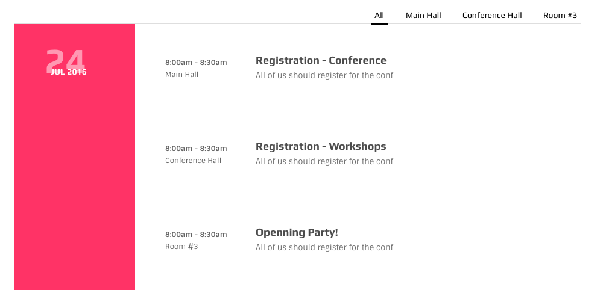

# Agenda



The skeleton of a agenda table is:

```text
<div class="ol-agenda sticky-type">
  // filters
  <ul class="filters">
  </ul>

  //sections
  <div class="ag-section"></div>

  <div class="ag-section"></div>

  <div class="ag-section"></div>

</div>
```

Each section should be as follow:

```text
<div class="ag-section">

  <div class="section-head">
    <div class="date with-shaded-label">
      <span class="shaded-label">26</span><span>JUL 2016 </span>
    </div>
  </div>

  <div class="section-body">
    //items
  </div>

</div>
```

Inside each section there can be several items each should be as follow:

```text
<div data-filter="room-1" class="item">

  <div class="info">
    <span><strong>8:00am - 8:30am</strong></span>
    <span>Main Hall</span>
  </div>

  <div class="contents">
    <h3 class="title">The Willow's Game</h3>
    <h4 class="subtitle">Let's get a coffee or two!</h4>
    <div class="extra-description">
      <p>Lorem ipsum dol...</p>
      <p>Ornatus commune et sed....</p>
    </div>
  </div>

</div>
```

* The `data-filter` will be used for filtering purpose.
* The `extra-description` is the hidden part and will be toggles per click

