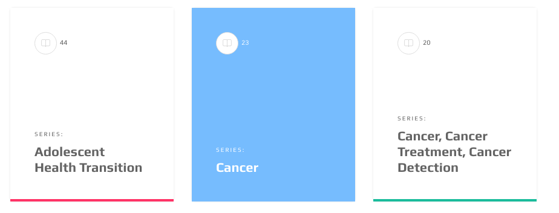
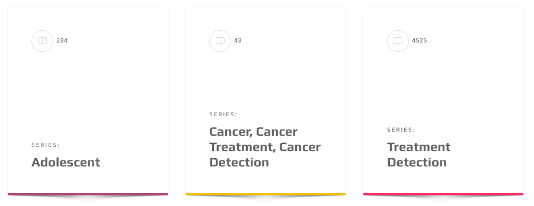
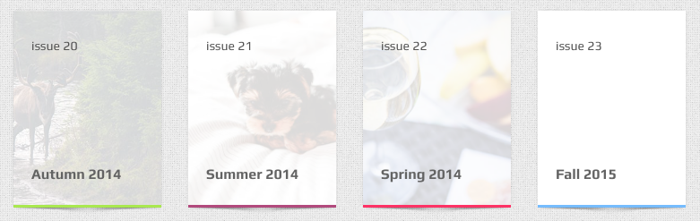

# Book Element


```text
<a href="#" class="book-el">
  <div class="contents">

    <div class="item-meta">
      <i class="oli oli-bookmark"></i><span class="side-info">44</span>
    </div>

    <div class="title-wrapper">
      <h6 class="sub-title">Series:</h6>
      <h2 class="title">Adolescent health transition</h2>
    </div>

  </div>
 </a>
```

This element consists of two sections 1. `.item-meta` which is used for metadata purpose and is positioned at the top 2. `.title-wrapper` which is used for the title

Above example does not uses thumbnail or cover for the element.

### With cover

You should add an image with class of `.set-me` to the element and also add `.set-bg` class to book element

```text
  <a href="#" class="book-el set-bg">
    
  <div class="contents">

    <div class="item-meta">
      <i class="oli oli-bookmark"></i><span class="side-info">215</span>
    </div>

    <div class="title-wrapper">
      <h6 class="sub-title">Series:</h6>
      <h2 class="title">Adolescent health transition</h2>
    </div>

  </div>
 </a>
```

That will produce the following image:


### Color Skins

 Add these classes to `.book-el`

* `.skin-blue`
* `.skin-green`
* `.skin-purple`
* `.skin-yellow`
* `.skin-red`
* `.skin-cyan`
* `.skin-lemon`

### Shadow

 To add shadow to this element add `.shadow` class

```text
class="book-el shadow skin-yellow"
```

### Alternative Contents

There are some variations for content type:


The HTML markup will be

```text
<a href="#" class="book-el set-bg skin-blue">
  
  <div class="contents">

    <div class="item-meta">
      <h6 class="date">12 Oct 2015</h6>
      <h6 class="cat">Seminar</h6>
    </div>

    <div class="title-wrapper">
      <h2 class="title">Create Some Beautiful Images</h2>
    </div>

  </div>
</a>
```

**Note** to `.date` and `.cat` classes. Also you can have a `h6` with class of `.author` if you want to have author name at third line \(`<h6 class="author">By John Doe</h6>`\)

## Mini!



This is an exciting variation of this element and it uses a simple `.mini` class to achieve this. That simple!

```text
<a href="#" class="book-el mini shadow set-bg skin-red">
  
  <div class="contents">

    <div class="item-meta">
      <span>issue 24</span>
    </div>

    <div class="title-wrapper">
      <h2 class="title">Autumn 2015</h2>
    </div>

  </div>
</a>
```

