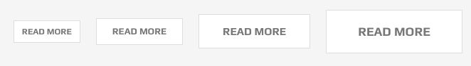
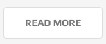
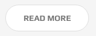
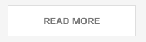
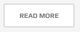
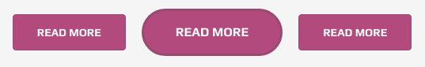
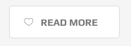
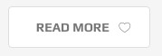

# buttons

A typical button can be added to page using following markup:

```text
<a href="#" class="btn">--caption on button---</a>
```

### Size

By adding size related classes to `.btn` class-name, various sizes of buttons can be achieved:

* `.btn-extra-small` stans for a very small button
* `.btn-small` stans for a small button
* `.btn-medium` stans for a medium button
* `.btn-large` stans for a large button



### Shape

Various shapes for your buttons are availabe.

#### Rounded corner

Just add `.btn-round`



#### Circle

Just add `.btn-circle`



#### Wide

Just add `.btn-wide`



#### Thick border

Just add `.btn-thick-border`



### Coloring and Skin

Sometime you would want to add ad shiny button to grab your visitor's attention.

#### Transparent buttons

In some cases you would wish to use a button with transparent background. The it is already there and you can use three classes

`.btn-trans` which is notmal transparency

there are tow class-names that can be added to this class in order to acheive a better visual for dark and white scenarios:

* `.btn-tans .btn-skin-dark` to use the botton in light and white backgrounds.
* `.btn-tans .btn-skin-white` if you want to use the botton in dark backgrounds.

#### Skins

You can choose from 6 color variations by adding these classes to the element.

* `.btn-skin-red`
* `.btn-skin-green`
* `.btn-skin-cyan`
* `.btn-skin-yellow`
* `.btn-skin-dark`
* `.btn-skin-blue`

eg: here is the code sample for the below image:

```text
<a href="#" class="hidden-sm hidden-xs btn btn-medium btn-round btn-skin-purple">read more</a>
<a href="#" class="btn btn-large btn-thick-border btn-circle btn-skin-purple">read more</a>
<a href="#" class="btn btn-medium btn-round btn-skin-purple">read more</a>
```



### Button with Icon

You can add any icon to the **right** or **left** of a button using the followign markup:

```text
<a href="#" class="hidden-sm hidden-xs btn btn-medium btn-round">
  <i class="oli oli-like"></i>
  <span>read more</span>
 </a>
```

Above code will generate the following:



To add the icon to the right side of the button you will need to add `.btn-icon-right` class to the button:

```text
<a href="#" class="hidden-sm hidden-xs btn btn-medium btn-round btn-icon-right">
  <i class="oli oli-like"></i>
  <span>read more</span>
 </a>
```



### Animated Icons

To get the icon to anomate on hover use the following code sample

```text
<a href="#" class="btn btn-medium btn-round btn-anim-i">
  <i class="oli oli-forward"></i>
  <span>read more</span>
</a>
```

As you can see the only difference is the addition of `.btn-anim-i` class.

You can achieve the simillar effect on the right of icons by simply adding `.btn-icon-right`:

```text
<a href="#" class="btn btn-medium btn-round btn-icon-right btn-anim-i">
  <i class="oli oli-forward"></i>
  <span>read more</span>
</a>
```

### Drawer Effect

Just add the `.btn-anim-drawer` class to the btn

```text
<a href="#" class="btn btn-medium btn-round btn-anim-drawer">read more</a>
```

Simply add `.btn-skin-dark` to get above effect at dark containers

```text
<a href="#" class="btn btn-medium btn-round btn-anim-drawer btn-skin-dark">read more</a>
```

### Split Effect

The markup for this special effect of button is as bellow:

```text
<a href="#" data-text="Read More" class="btn btn-medium btn-round btn-an-split">
  <span>read more</span>
</a>
```

Note the additional `data-text` and class of `.btn-an-split`

## Boootstrap Default Buttons

You can use the built-in bootstrap buttons if you want. Justo go to the [bootstrap documentation](http://getbootstrap.com/css/#buttons) and learn how.

