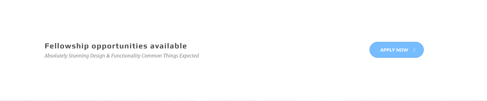

# callouts

Callouts are great tools to encourage visitors to do an action. Here is a simple example:



## Markup

```text
<section class="section">
  <div class="container">
    <div class="row">

      <!-- -----Begin call to action-->
      <div class="call-out tb-vcenter-wrapper">

        <div class="col-sm-9 vcenter">
          <h2 class="title">Fellowship opportunities available</h2>
          <h4 class="sub-title">Absolutely Stunning Design &amp; Functionality Common Things Expected</h4>
        </div>

        <div class="col-sm-3 vcenter text-center">
          <a href="#" class="btn btn-medium btn-anim-i btn-skin-blue btn-icon-right btn-circle">
            <i class="oli oli-forward"></i>
             <span>Apply now</span>
            </a>
         </div>

      </div>
      <!-- -----End call to action-->

    </div>
  </div>
</section>
```

Using `.vcenter` class in `.tb-vcenter-wrapper` parent would position the child vertically centered, so that the button at the right will be vertically aligned with the text at the left.

## Add Parallax Background

You will add the background to the `section` that contains the call to action by usong `data-img-src` attribute along with the `.parallax-layer` class. More on this at parallax sections.

```text
<section data-img-src="../../assets/img/backgrounds/09.jpg" class="section parallax-layer ov-light-alpha-90">
  ...
</section>
```


## Alternative

```text
<section data-img-src="../../assets/img/backgrounds/09.jpg" class="section dark-wrapper parallax-layer ov-grad1-alpha-70">
  <div class="container">
    <div class="row">

      <!-- -----Begin call to action-->
      <div class="call-out tb-vcenter-wrapper">
        <div class="col-sm-8 col-sm-push-4 vcenter">
          <h2 class="title">Fellowship opportunities available</h2>
          <h4 class="sub-title">Absolutely Stunning Design &amp; Functionality Common Things Expected</h4>
        </div>
        <div class="col-sm-4 col-sm-pull-8 vcenter text-right">
          <a href="#" class="btn btn-medium btn-circle"><i class="oli oli-unlock-filled"></i>Apply now</a>
        </div>
      </div>
      <!-- -----End call to action-->

    </div>
  </div>
</section>
```


**Notice** the usage of `.col-sm-push-4` and `.col-sm-pull-8`. These classes are asset classes of Bootsstrap to allow you manipulate the columns. Using above code will cause teh button to remain at the bottom of the texts at mobile devices while the button is at the left at desktop devices.

