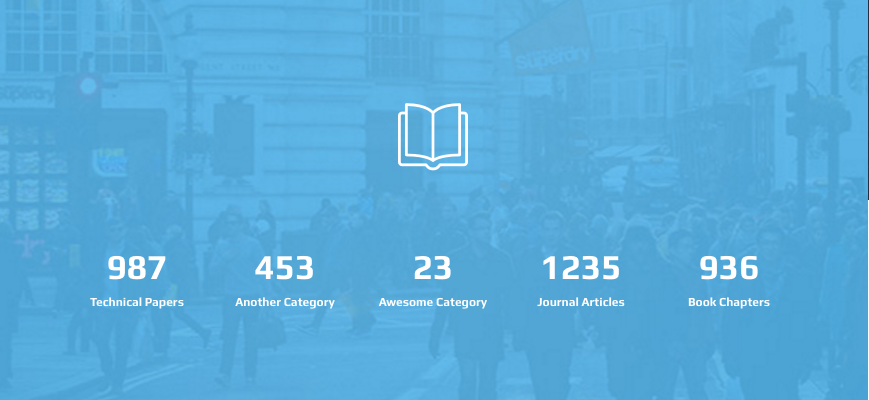

# Carousel

This template uses [Owl Carousel 2](http://www.owlcarousel.owlgraphic.com/) for carousels. It is simple to use. We have added a JS layer over it to map it's settings with HTML attributes. You can pass following settings as HTML attributes to carousel element

* `data-dots` \| true or false
* `data-nav` \| true or false
* `data-slidespeed` \| integer, default is 2000
* `data-paginationspeed` \| integer, default is 2000
* `data-margin` \| integer, default is 0
* `data-autoplaytime` \| integer, default is 3000
* `data-loop` \| true or false
* `data-cols-lg` \| number of columns in large screens
* `data-cols-md` \| number of columns in medium screens
* `data-cols-sm` \| number of columns in 600px screens
* `data-cols-xs` \| number of columns in 480ox screens
* `data-cols-xxs` \| number of columns in bellow 480px screens
* `data-cols` \| number of columns in all screens

The basic HTML markup of a carousel is like

```text
<div class="owl-carousel owwwlab-theme">
  <div>...</div>
  <div>...</div>
  <div>...</div>
</div>
```

Use attributes like so:

```text
<div class="owl-carousel owwwlab-theme" data-dots="true" data-loop="false">
  <div>...</div>
  <div>...</div>
  <div>...</div>
</div>
```

There are some classes that will help you change some aspects.

* Adding `.owwwlab-theme` will use the designated theme
* By default the navigatuon bullets will be placed at bottom and center
* Adding `.nav-top-center` will place the navigation to top and center
* Adding `.nav-top-right` will place the navigation to top and right

## News Carousel


```text
<div class="featured-news-box set-bg">
  

  <!-- -----Begin carousel-->
  <ul data-cols-all="1" data-margin="0" data-nav="false" data-dots="true" data-autoplaytime='5000' class="featured-news owl-carousel items owwwlab-theme">

    <li class="item">
      <div class="date">24 Oct 2015</div>
      <h3 class="title"> <a href="#">New software being developed to help answer complex biological questions and lorem ipsum</a></h3>
    </li>

    <li class="item">
      <div class="date">24 Oct 2015</div>
      <h3 class="title"> <a href="#">Planning permission granted for new centre for food and health</a></h3>
    </li>

    <li class="item">
      <div class="date">24 Oct 2015</div>
      <h3 class="title"> <a href="#">Thai student stresses benefits of learning Welsh</a></h3>
    </li>

    <li class="item">
      <div class="date">24 Oct 2015</div>
      <h3 class="title"> <a href="#">Undergrads Dive Deep for Submarine Competition</a></h3>
    </li>

  </ul>
  <!-- -----End carousel-->
</div>
```

* `.featured-news-box` will prepare the scene
* `.set-bg` will add `.set-me` image as the background image
* `.featured-news` which is added to `.owl-carousel` will customize the default styles for carousle.

## Summary Box

This is a unique element, use it to give summary of your works, publications, and other aspects of your works. 

Here is the HTML

```text
<div data-img-src="../../assets/img/backgrounds/summ-bg.jpg" class="summary-box parallax-layer pull-up-200 pull-up-xs-100">

  <i class="oli oli-literature"></i>

  <!-- -----Begin carousel-->
  <ul data-cols-lg="5" data-cols-md="4" data-cols-sm="3" data-cols-xs="2" data-cols-xxs="1" data-margin="30" data-nav="false" data-loop="true" class="summaries owl-carousel items owwwlab-theme">
    <li class="item"><a href="#">
        <div class="number">1235</div>
        <div class="title">Journal Articles</div></a></li>
    <li class="item"><a href="#">
        <div class="number">936</div>
        <div class="title">Book Chapters</div></a></li>
    <li class="item"><a href="#">
        <div class="number">20k</div>
        <div class="title">Reports</div></a></li>
    <li class="item"><a href="#">
        <div class="number">987</div>
        <div class="title">Technical Papers</div></a></li>
    <li class="item"><a href="#">
        <div class="number">453</div>
        <div class="title">Another Category</div></a></li>
    <li class="item"><a href="#">
        <div class="number">23</div>
        <div class="title">Awesome Category</div></a></li>
  </ul>
  <!-- -----End carousel-->

</div>
```

