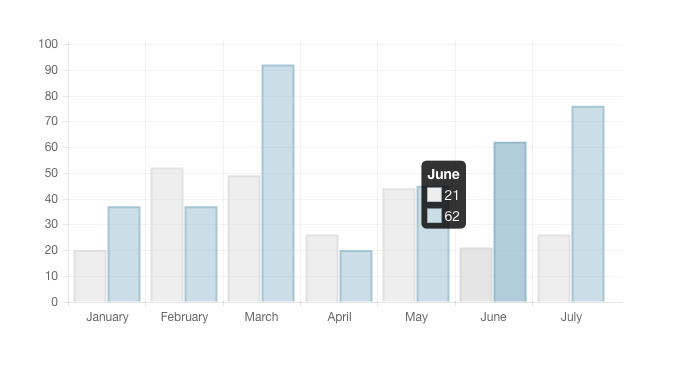
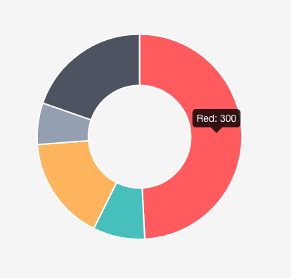

# charts

## Bar Chart



**HTML**

```text
<canvas id="barchart"></canvas>
```

**JavaScript**

```text
<script>
  var randomScalingFactor = function(){ return Math.round(Math.random()*100)};
  var barChartData = {
      labels : ["January","February","March","April","May","June","July"],
      datasets : [
          {
              fillColor : "rgba(220,220,220,0.5)",
              strokeColor : "rgba(220,220,220,0.8)",
              highlightFill: "rgba(220,220,220,0.75)",
              highlightStroke: "rgba(220,220,220,1)",
              data : [randomScalingFactor(),randomScalingFactor(),randomScalingFactor(),randomScalingFactor(),randomScalingFactor(),randomScalingFactor(),randomScalingFactor()]
          },
          {
              fillColor : "rgba(151,187,205,0.5)",
              strokeColor : "rgba(151,187,205,0.8)",
              highlightFill : "rgba(151,187,205,0.75)",
              highlightStroke : "rgba(151,187,205,1)",
              data : [randomScalingFactor(),randomScalingFactor(),randomScalingFactor(),randomScalingFactor(),randomScalingFactor(),randomScalingFactor(),randomScalingFactor()]
          }
      ]
  }
  function showbarchart(){
      var ctx = document.getElementById("barchart").getContext("2d");
      new Chart(ctx).Bar(barChartData,{responsive : true});
  }

</script>
```

## Doughnut Chart

 **HTML**

```text
<canvas id="DoughnutChart"></canvas>
```

**JavaScript**

```text
<script>
  var doughnutData = [{
          value: 300,
          color:"#F7464A",
          highlight: "#FF5A5E",
          label: "Red"
      },
      {
          value: 50,
          color: "#46BFBD",
          highlight: "#5AD3D1",
          label: "Green"
      },
      {
          value: 100,
          color: "#FDB45C",
          highlight: "#FFC870",
          label: "Yellow"
      },
      {
          value: 40,
          color: "#949FB1",
          highlight: "#A8B3C5",
          label: "Grey"
      },
      {
          value: 120,
          color: "#4D5360",
          highlight: "#616774",
          label: "Dark Grey"
      }
  ];
  function showDoughnutChart(){
      var ctx2 = document.getElementById("DoughnutChart").getContext("2d");
      new Chart(ctx2).Doughnut(doughnutData, {responsive : true});
  }
</script>
```

 **You can find other types of charts and examples from** [**http://www.chartjs.org/**](http://www.chartjs.org/)

