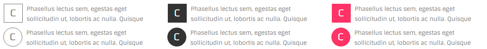

# dropcaps



## Markup

```text
<p>
  <span class="ol-dropcaps circle bordered">C</span>Phasellus lectus sem, egestas...
</p>
```

### Shapes

* square: `.square` class
* circle: `.circle` class

### Colored

* colored: `.colored` class

### Filled

* filled: `.filled`
* dark fill: `.filled` + `.dark-skin`

