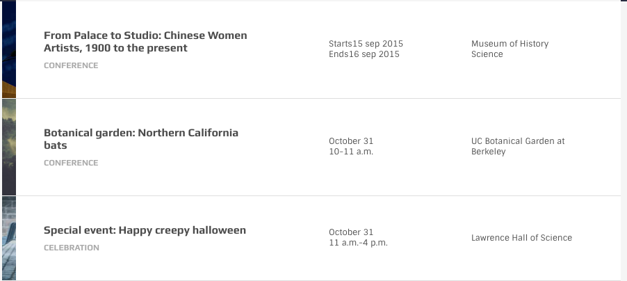

# Event Table

This is a special element used for event lists or any similar concept



```text
<div class="event-table">

  <a href="#" class="item">
    <div class="image-wrapper set-bg">
      
    </div>

    <div class="cols-wrapper clearfix">

      <div class="col-md-6 vcenter title-col">
        <div class="wrap">
          <h3 class="title">From Palace to Studi...</h3>
          <h4 class="cat">Conference</h4>
        </div>
      </div>

      <div class="col-md-3 vcenter date-col">
        <div class="wrap">
            <div class="date"><span>Starts</span>15 sep 2015</div>
            <div class="date"><span>Ends</span>16 sep 2015</div>
          </div>
      </div>

      <div class="col-md-3 vcenter location-col">
        <div class="wrap">Museum of History Science</div>
      </div>

    </div>
    <div class="arrow-wrapper"><i class="icon oi-forward"></i></div>
  </a>

  ...

</div>
```

