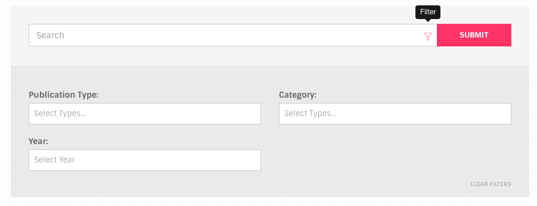

# Form Elements

## General Forms

Generally forms are the same as Bootstrap forms. Examples and usages of forms can be found at [Bootstrap documentation](http://getbootstrap.com/css/#forms).

## Search Forms



### HTML

```text
<div class="search-box inline-filters">
  <form>
    <!-- search bar row -->
    <div class="row form-inline">
      <div class="col-sm-10 col-xs-8 form-group with-filter">
        <input type="text" placeholder="Search" class="form-control"><a href="#" data-toggle="tooltip" data-placement="top" title="Filter" class="toggle-filter"><i class="icon oi-filter"></i></a>
      </div>
      <div class="col-sm-2 col-xs-4 form-group">
        <input type="submit" value="Submit" class="btn btn-small btn-skin-red btn-block">
      </div>
    </div>

      <!-- filters row -->
      <div class="row filters"><a href="#" class="clear-selectize">Clear Filters</a>

        <div class="col-sm-6">

          <div class="form-group">
            <label>Publication Type:</label>
            <select data-placeholder="Select Types..." multiple="multiple" class="selectize">
              <option value=""></option>
              <option value="Journal Article">Journal Article</option>
              ...
            </select>
          </div>

          <div class="form-group">
            <label>Year:</label>
            <select data-placeholder="Select Year" multiple="multiple" class="selectize">
              <option value=""> </option>
              <option value="2000">2000</option>
              ...
            </select>
          </div>  
        </div>

        <div class="col-sm-6">
          <div class="form-group">
            <label>Category:</label>
            <select data-placeholder="Select Types..." multiple="multiple" class="selectize">
              <option value=""></option>
              <option value="Physics">Physics</option>
              ...
            </select>
          </div>
        </div>

      </div>
  </form>
</div>
```

This consists of two visually distinct sections; 1. The search bar `.row` 2. Filters `.row`

**Note:** Don't forget to add `form` element and `action` attributes

## `.selectize`

This class is applied to make use of [**selectize.js** ](http://selectize.github.io/selectize.js/)plugin.

