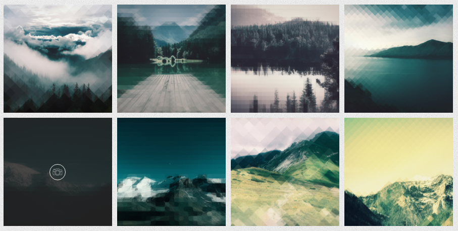
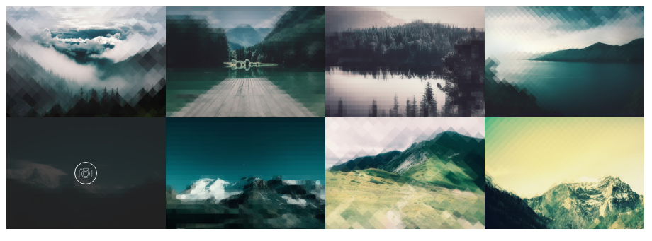
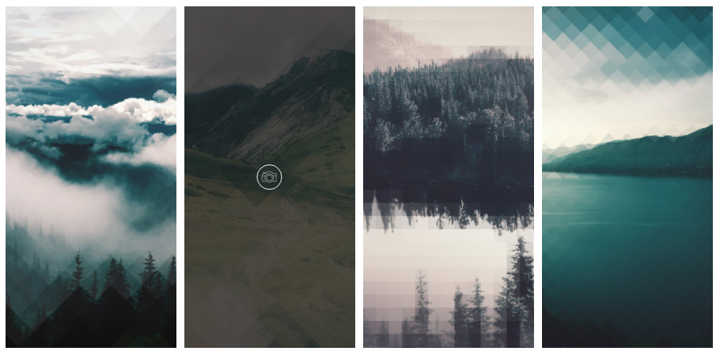

# Gallery



Galleirs use `.ol-grid` class

```text
<div class="ol-grid grid col-4 ol-lightbox-gallery with-gutter">

  <a href="../../assets/img/portfolio/01.jpg" class="grid-item ol-lightbox">
    <div class="gi-wrapper ol-hover hover-1">
      <div class="img-layer set-bg"></div>
      <div class="ol-overlay ov-dark-alpha-80"></div>
      <div class="icons"><i class="oli oli-camera2"></i></div>
    </div>
  </a>
  ...
</div>
```

* `.col-4` means that this grid is a 4-column one
* Also you can use `.col-1`, `.col-2`, `.col-3`, `.col-4`, `.col-5`
* `.with-gutter` add the gutter between images

## `.ratio-2`

This makes images to fit the ratio of 70% height to width

```text
<a href="../../assets/img/portfolio/01.jpg" class="grid-item ol-lightbox ratio-2">
```



## `.ratio-3`

This makes images to fit the ratio of 200% height to width

```text
<a href="../../assets/img/portfolio/01.jpg" class="grid-item ol-lightbox ratio-3">
```



