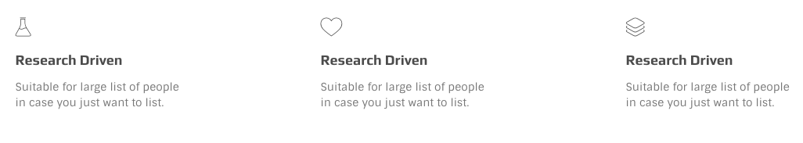
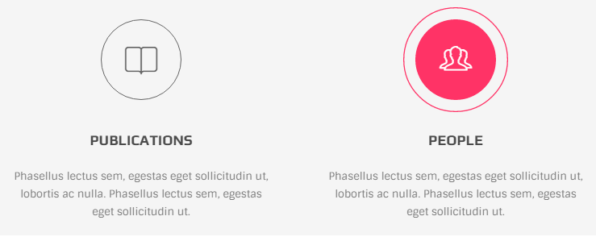
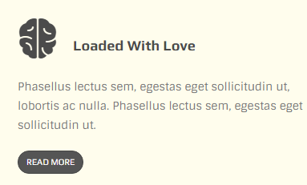
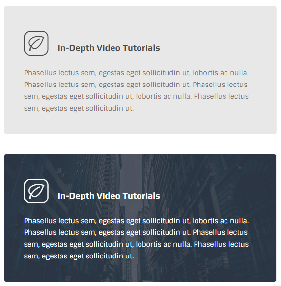
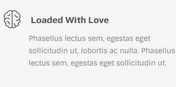
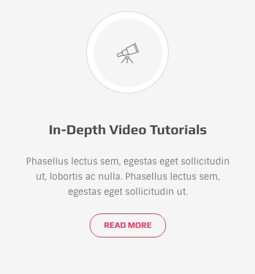
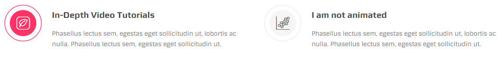
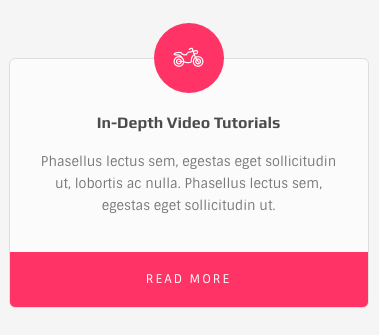
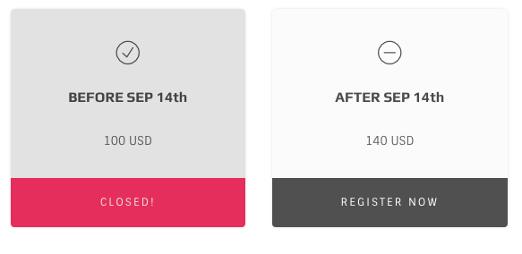
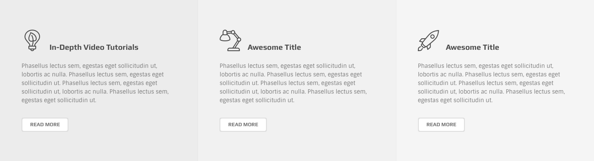

# Icon Box

## Version 1

It is represented by `.ib-v1` class. 

```text
<div class="icon-box ib-v1">
  <i class="oli oli-beaker"></i>
  <h3 class="title">Research Driven</h3>
  <p>Suitable for large list of people<br> in case you just want to list.</p>
</div>
```

## Version 2

It is represented by `.ib-v2` class and the result would be:



```text
<div class="icon-box ib-v2">
  <a href="#">
    <i class="oli oli-beaker"></i>
    <h3 class="title">publications</h3>
  </a>
  <p>Phasellus lectus sem...</p>
</div>
```

## Version 3

It is represented by `.ib-v3` class. The markup is as below:

```text
<div class="icon-box ib-v3">
  <i class="oli oli-strategy"></i>
  <h3 class="title"><span>loaded with love</span></h3>
  <p>Phasellus lectus sem, ...</p>
  <a href="#" class="btn btn-extra-small btn-circle btn-skin-dark">read more</a>
</div>
```

The result would be:



Adding `.ib-boxed` class to this item would lead to:



**skins**

* Grey skin: default
* Blue skin: "ib-blue" class
* Dark skin: "ib-dark" class
* Red skin: "ib-red" class
* Greeb skin: "ib-green" class

Note You can also use "set-bg" class and add a background image as well:

```text
<div class="icon-box ib-v3 ib-boxed set-bg">
    
    <i class="icon oi-scatter-plot"></i>
    <h3>Awesome title</h3>
    <p>Phasellus lectus sem, egestas eget sollicitudin ut, lobortis...</p>
</div>
```

## version 4

It is represented by `.ib-v4` class. The markup is just like version 3 \(as you noticed using button is optional\) & the result would be:



By adding `.icon-theme` class to `.ib-v4` the icon would be colored as theme color.

## Version 5

It is represented by `.ib-v5` class.



```text
<div class="icon-box ib-v5">
  <i class="oli oli-telescope2"></i>
  <h3 class="title">In-Depth Video Tutorials</h3>
  <p>Phasellus lectus sem...</p>
  <a href="#" class="btn btn-small btn-circle btn-skin-red btn-trans">read more</a>
</div>
```

By adding `.no-anim` class there would be no animation effect on mouse hover.

## Version 6

It is represented by "ib-v6" class. The markup is shown below:

```text
<div class="icon-box ib-v6">
    <i class="icon oi-fiber"></i>
    <div class="ib-wrap">
        <h3>In-Depth Video Tutorials</h3>
        <p>Phasellus lectus sem, egestas eget sollicitudin ut, lobortis...</p>
    </div>
</div>
```

The result would be:



By adding `.no-anim` class there would be no animation effect on mouse hover.

## Version 7

It is represented by `.ib-v7` class.

```text
<div class="icon-box ib-v7">
  <i class="oli oli-motorcycle"></i>
  <div class="ib-wrap">
    <h3 class="title">In-Depth Video Tutorials</h3>
    <p>Phasellus lectus sem.....</p>
    <a href="#" class="ib-btn">read more</a>
  </div>
</div>
```



**skins**

* Theme color skin : default
* Dark skin : "ib-dark" class
* Blue skin : "ib-blue" class
* Green skin : "ib-green" class
* Red skin : "ib-red" class

## version 8

It is represented by `.ib-v8` class.

```text
<div class="icon-box ib-v8 dark-overlay">
  <i class="oli oli-ok"></i>
  <h3 class="title">BEFORE SEP 14th</h3>
  <p>100 USD</p>
  <a href="#" class="ib-btn">CLOSED!</a>
</div>
```



**skins**

* Theme color skin : default
* Dark skin : `.ib-dark` class
* Blue skin : `.ib-blue` class
* Green skin : `.ib-green` class
* Red skin : `.ib-red` class

By adding `.dark-overlay` class the item would be inactive and not clickable.

## Grad-box

Grad boxes are designed to be use in full-width no-gap between grids but they can be used separately as well. Markup is like:

```text
<section class="section full-width p-top-0 p-bottom-0">
  <div class="container">
    <div class="row gradient-cols-wrapper sync-cols-height light-grad">

      <div class="col-md-4">
        <div class="inner-wrapper">
          // place for your iconbox
        </div>
      </div>

      <div class="col-md-4">
        <div class="inner-wrapper">
          // place for your iconbox
        </div>
      </div>

      <div class="col-md-4">
        <div class="inner-wrapper">
          // place for your iconbox
        </div>
      </div>

    </div>
  </div>
</section>
```



To make it dark switch `.light-grad` with `.dark-wrapper` class

