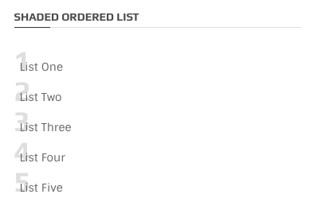
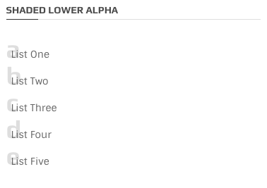
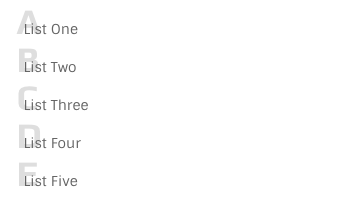
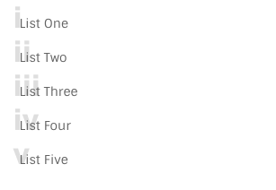
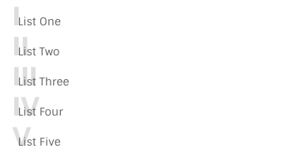
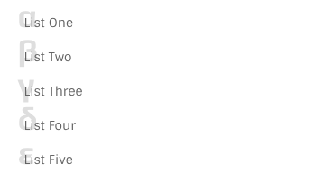
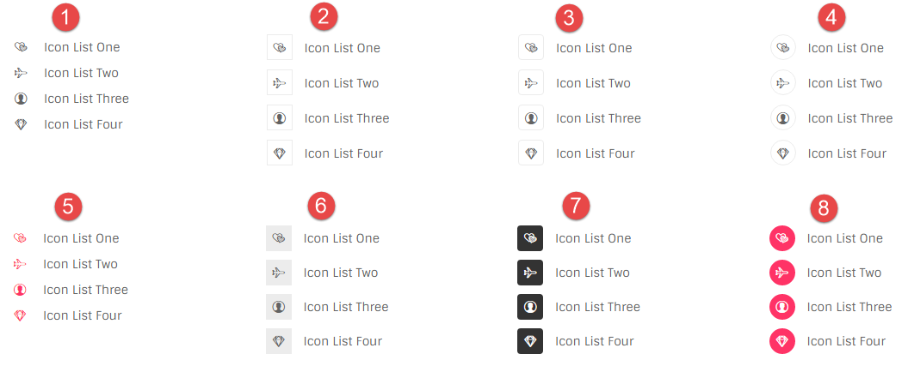

# Lists

### Numbers



```text
<ol class="with-shaded-label">
  <li>List One</li>
  <li>List Two</li>
  <li>List Three</li>
  <li>List Four</li>
  <li>List Five</li>
</ol>
```

### Lower Alpha



```text
<ol class="with-shaded-label ol-lower-alpha">
  <li>List One</li>
  <li>List Two</li>
  <li>List Three</li>
  <li>List Four</li>
  <li>List Five</li>
</ol>
```

### Upper Alpha



```text
<ol class="with-shaded-label ol-upper-alpha">
  <li>List One</li>
  <li>List Two</li>
  <li>List Three</li>
  <li>List Four</li>
  <li>List Five</li>
</ol>
```

### Lower Roman



```text
<ol class="with-shaded-label ol-lower-roman">
  <li>List One</li>
  <li>List Two</li>
  <li>List Three</li>
  <li>List Four</li>
  <li>List Five</li>
</ol>
```

### Upper Roman



```text
<ol class="with-shaded-label ol-upper-roman">
  <li>List One</li>
  <li>List Two</li>
  <li>List Three</li>
  <li>List Four</li>
  <li>List Five</li>
</ol>
```

### Greek



```text
<ol class="with-shaded-label ol-greek">
  <li>List One</li>
  <li>List Two</li>
  <li>List Three</li>
  <li>List Four</li>
  <li>List Five</li>
</ol>
```

### Simple lists

Above codes can be used to get simple ordered lists without using `.whith-shaded-label` class

## List with icon



### Markup

```text
<ul class="icon-list">
    <li><i class="oli oli-two-hearts"></i> Icon List One</li>
    <li><i class="oli oli-airplane-mode-on"></i> Icon List Two</li>
    <li><i class="oli oli-user-male-circle-filled"></i> Icon List Three</li>
    <li><i class="oli oli-diamond"></i> Icon List Four</li>
</ul>
```

### Variations

1. You can see the default icon list's markup above.
2. It is represented by `.icon-list icon-border` class & the ul element would be:

   ```text
   <ul class="icon-list icon-border">
   ```

3. It is represented by `icon-list icon-border radius` classes. Ul element would be like no.2.
4. It is represented by `icon-list icon-border circle` classes. Ul element would be like no.2.
5. It is just like the general markup except `theme-color` has been added to every icon element of the list, so icon would be:

   ```text
   <li><i class="theme-color oli oli-two-hearts"></i> Icon List One</li>
   ```

6. It is represented by `icon-list icon-bg-box` classes. Ul element would be like no.2.
7. It is represented by `icon-list icon-dark radius` classes. Ul element would be like no.2.
8. It is represented by `icon-list icon-theme circle` classes. Ul element would be like no.2.

