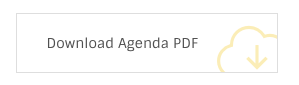

# Iconic Link



```text
<a href="#" class="ol-iconic-link skin-yellow">
  <i class="oli oli-download_2"></i>
  Download Agenda PDF
</a>
```

This element is a simple link that is designed to be used to grab use's attention.

There is only one variation to this element at the moment ant it uses `.size-tall` class

## Color skins

* `.skin-red`
* `.skin-blue`
* `.skin-yellow`
* `.skin-green`
* `.skin-purple`
* `.skin-cyan`
* `.skin-lemon`

