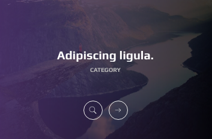
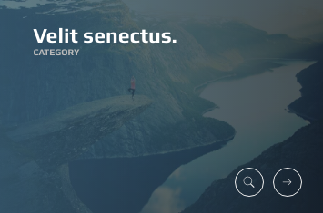
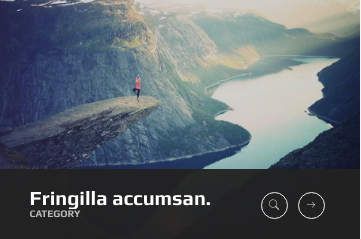
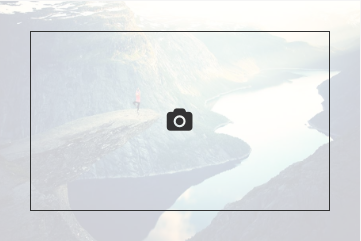

# Images

There are plenty of hover effects that you can use to make your images interactive.

## Variation 1


```text
<div class="ol-hover hover-1">
  
  <div class="ol-overlay ov-dark-alpha-80"></div>

  <div class="icons">
    <a href="../../assets/img/hovers/02.jpg" class="ol-lightbox">
      <i class="oli oli-search"></i>
    </a>
    <a href="#">
      <i class="oli oli-right"></i>
    </a>
  </div>

</div>
```

* `.ol-hover` class is the general class that should be used to specify that this is a hover element
* `.hover-1` specifies the hover variation
* `.ol-overlay` stands for the overlay which the `.ov-dark-alpha-80` determines the visual
* `.icons` wrapps the icons
* `ol-lightbox` maked the anchor a lightbox, don't forget to add the image source to href

## Variation 2



```text
<div class="ol-hover hover-2">
  
  <div class="ol-overlay ov-grad1-alpha-80"></div>

  <div class="icons">
    <a href="../../assets/img/hovers/02.jpg" class="ol-lightbox"><i class="oli oli-search"></i></a>
    <a href="#"><i class="oli oli-right"></i></a>
  </div>

  <h3 class="title"><a href="#">Adipiscing ligula.</a></h3>
  <h4 class="subtitle">category</h4>

</div>
```

Above code adds `h3.title` and `h4.subtitle` to the markup and off course uses `.hover-2`

## Variation 3



```text
<div class="ol-hover hover-3">
  
  <div class="ol-overlay ov-grad6-alpha-80"></div>

  <div class="icons">
    <a href="../../assets/img/hovers/02.jpg" class="ol-lightbox"><i class="oli oli-search"></i></a>
    <a href="#"><i class="oli oli-right"></i></a>
  </div>

  <h3 class="title"><a href="#">Velit senectus.</a></h3>
  <h4 class="subtitle">category</h4>

</div>
```

Above code uses `.hover-3` and it is pretty much similar to hover2

## Variation 4



```text
<div class="ol-hover hover-4">

  

  <div class="ol-overlay ov-grad1-alpha-20"></div>

  <div class="cover ov-dark-alpha-95"></div>

  <div class="icons">
    <a href="../../assets/img/hovers/02.jpg" class="ol-lightbox"><i class="oli oli-search"></i></a>
    <a href="#"><i class="oli oli-right"></i></a>
  </div>

  <h3 class="title"><a href="#">Fringilla accumsan.</a></h3>
  <h4 class="subtitle">category</h4>

</div>
```

This variation adds a `<div class="cover ov-dark-alpha-95"></div>` which is the dark bottom bar

## Variation 5



```text
<a href="../../assets/img/hovers/02.jpg" class="ol-hover hover-5 ol-lightbox">
  
  <div class="ol-overlay ov-light-alpha-80"></div>
  <div class="icons">
    <i class="fa fa-camera"></i>
  </div>
</a>
```

This element is not similar to other hover effects. It is essentially a anchor link which can be used as a lightbox \( like above example\) or a simple link

To use a text instead of an icon you can change

```text
<div class="icons">
  <i class="fa fa-camera"></i>
</div>
```

to

```text
<h3 class="title">Chaos Theory</h3>
```

