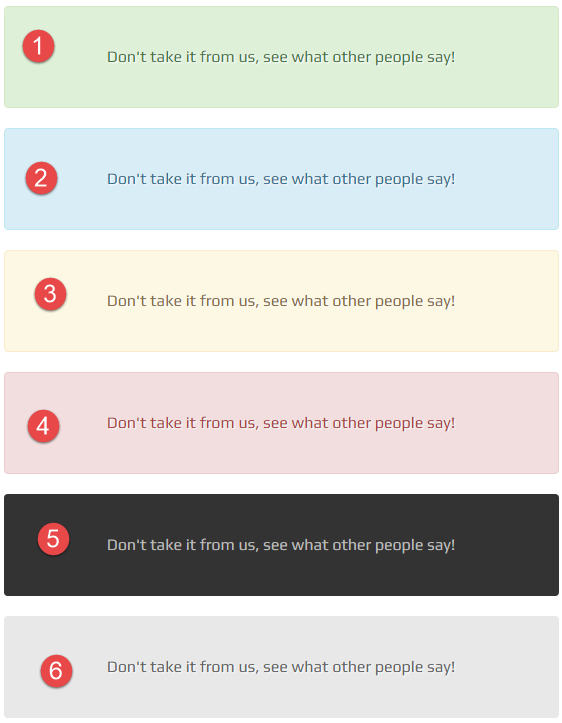
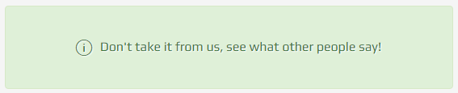

# notifications

## Variations

### Default



You can see the markup below:

```text
<div role="alert" class="alert alert-success">see what other people say!</div>
```

**Helper classes**: 1. `alert-success` 2. `alert-info` 3. `alert-warning` 4. `alert-danger` 5. `alert-dark` 6. `alert-gray`

These classes can be used with all other variations.

### With Icons



An icon would be added to the markup:

```text
 <div role="alert" class="alert alert-warning">
    <i class="oli oli-info"></i>see what other people say!
 </div>
```

### With Big Icons


It is represented by `with-big-icons` class as below:

```text
<div role="alert" class="alert with-big-icons alert-danger">
    <i class="oli oli-ok-filled"></i>see what other people say!
</div>
```

### Thin


It is represented by `alert-thin` class. You can use it with any other variations.

