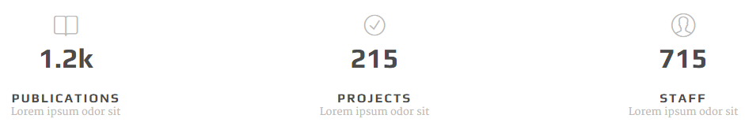
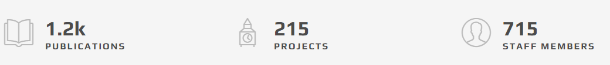

# numbers

## screenshot



## markup

```text
<div class="fact-item">
    <div class="fact-icon-wrap">
        <div class="fact-icon oli oli-bookmark"></div>
    </div>
    <div class="fact-number-wrap">
        <div class="fact-number">1.2k</div>
    </div>
    <h2 class="fact-title">publications</h2>
    <h4 class="fact-sub-title">Lorem ipsum odor sit</h4>
</div>
```

## variations

### default

The numbers are aligned center by default as you can see above. Using `fact-icon`, `fact-title` and `fact-sub-title` is optional.

### left aligned icon



As you can see below you can push the icon to the left using `left-aligned` and `left` classes:

```text
<div class="fact-item left-alined">
    <div class="fact-icon-wrap left">
        <div class="fact-icon oli oli-literature"></div>
    </div>
    <div class="fact-number-wrap">
        <div class="fact-number">1.2k</div>
    </div>
    <h2 class="fact-title">publications</h2>
</div>
```

