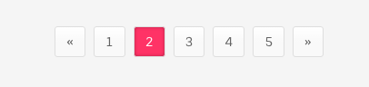

# Paginations

There are two types of pagination links available


```text
<nav class="ol-pagination lined-links">
  <ul class="pagination">
    <li><a href="#">«</a></li>
    <li><a href="#">1</a></li>
    <li class="active"><a href="#">2</a></li>
    <li><a href="#">3</a></li>
    <li><a href="#">4</a></li>
    <li><a href="#">5</a></li>
    <li><a href="#">»</a></li>
  </ul>
</nav>
```



```text
<nav class="ol-pagination">
  <ul class="pagination">
    <li><a href="#">«</a></li>
    <li><a href="#">1</a></li>
    <li class="active"><a href="#">2</a></li>
    <li><a href="#">3</a></li>
    <li><a href="#">4</a></li>
    <li><a href="#">5</a></li>
    <li><a href="#">»</a></li>
  </ul>
</nav>
```

