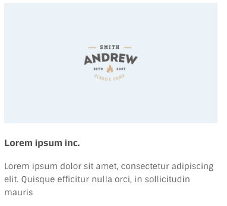
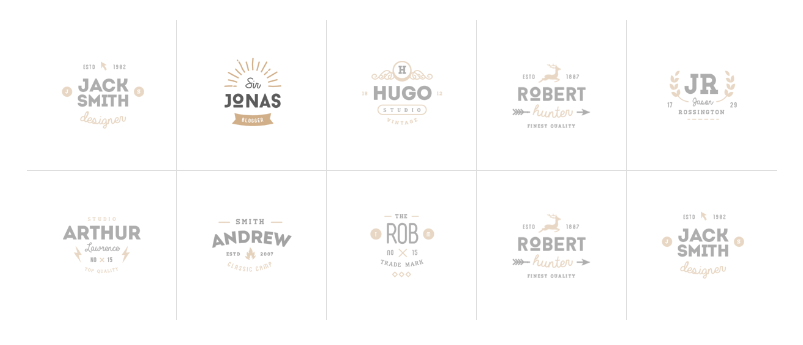

# Partners Logo

There is a simple way to show a logo, title, and description about your partners and it is using `featured item` like so:



The undelying code for above image is:

```text
<div class="featured-item text-left">
  <div class="features-image">
    
  </div>
  <h3 class="features-title">Lorem ipsum inc.</h3>
  <div class="features-des">Lorem ipsum....</div>
</div>
```

`.text-left` will align the texts to the left.

## Partners in a Carousel

Another great way to represent your partners to your users is a carousel maybe at the bottom of your page above the footer. 

Code snippet for the above image is as bellow:

```text
<div data-cols="6" data-cols-sm='3' data-cols-xs='2' data-cols-xxs='2' data-loop="true" class="owl-carousel items owwwlab-theme partner-logos">
  <div class="item partner-logo"></div>
  <div class="item partner-logo"></div>
  <div class="item partner-logo"></div>
  <div class="item partner-logo"></div>
  <div class="item partner-logo"></div>
  <div class="item partner-logo"></div>
  <div class="item partner-logo"></div>
</div>
```

## Partners in Grid

This grid can be achieved by the following snippet:

```text
<ul class="clients-grid grid-6">
  <li><a href="#"></a></li>
  <li><a href="#"></a></li>
  ...
</ul>
```

It is essentially a list that has a class of `.clients-grid` and the `.grid-6` is the variation of it.

* `.grid-6` for 6 columns
* `.grid-6` for 6 columns
* `.grid-5` for 5 columns
* `.grid-4` for 4 columns
* `.grid-3` for 3 columns
* `.grid-2` for 2 columns

