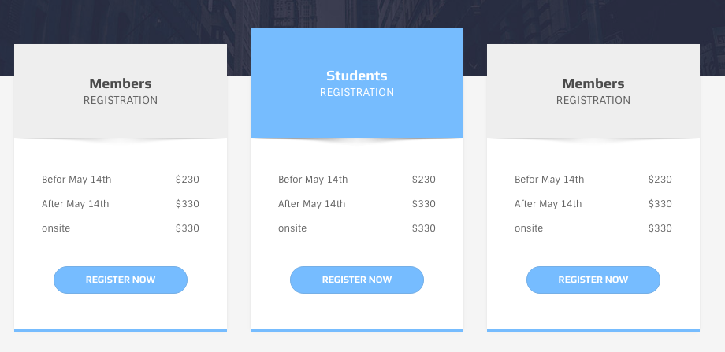

# Pricing Tables



The main identifier for the a price table item is `.ol-price-table`

```text
<div class="ol-price-table skin-blue">

  <div class="head shadow text-center">
    <div class="contents">
      <h3 class="title">Members</h3>
      <h6 class="subtitle">Registration</h6>
    </div>
  </div>

  <div class="body">
    <ul class="list-unstyled">
      <li>Befor May 14th<span class="pull-right">$230</span></li>
      <li>After May 14th<span class="pull-right">$330</span></li>
      <li>onsite<span class="pull-right">$330</span></li>
    </ul>
    <div class="text-center">
      <a href="#" class="btn btn-skin-blue btn-circle btn-small btn-wide">Register Now</a>
    </div>
  </div>

</div>
```

It consists of a `.head` and a `.body`.

* `.shadow` class makes that shadow bellow the head
* `.text-center` alignes the contents of head to center
* Body can contain anything

**Featured** price table takes the `.featured` class with it

```text
<div class="ol-price-table skin-blue featured">
```

There is a alight variation that can be seen at the demo of the template


the code snippet for the above image is:

```text
<div class="ol-price-table skin-red">
  <div class="head shadow text-center">
    <div class="contents">
      <h3 class="title">Silver</h3>
      <h6 class="subtitle">Sponsorship</h6>
      <p class="etc"> <strong>$3000</strong></p>
    </div>
  </div>
  <div class="body text-center">
    <ul class="list-unstyled">
      <li>Welcome Reception</li>
      <li>President’s Reception</li>
      <li>Welcome Gift</li>
      <li>Conference Bag</li>
      <li>Attendee's welcome gift</li>
    </ul><a href="#" class="btn btn-skin-red btn-circle btn-small btn-wide">Read More</a>
  </div>
</div>
```

Notice to the `p` with class of `etc` at the head.

## Color Skins

Add these classes to `.ol-price-table`

* `.skin-blue`
* `.skin-green`
* `.skin-purple`
* `.skin-yellow`
* `.skin-red`

