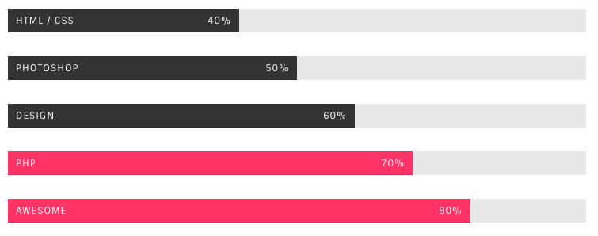
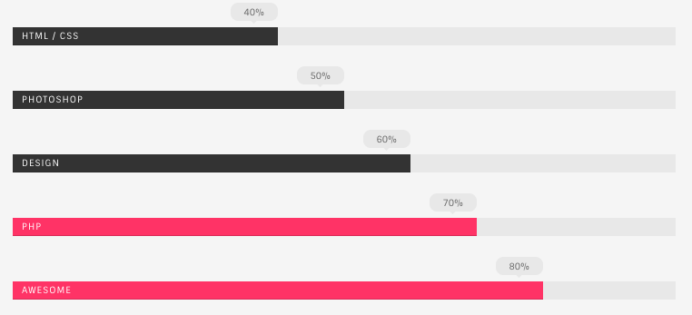

# Progress Bars



```text
<div class="progress">
  <div role="progressbar" aria-valuenow="40" aria-valuemin="0" aria-valuemax="100" style="width: 40%;" class="progress-bar">HTML / CSS<span>40%</span></div>
</div>
```

Add the `.progress-theme-color` class to `.progress` to get the theme color bar



Add the `.progress-on-top` class to `.progress` to get the above variation

```text
<div class="progress progress-on-top">
  <div role="progressbar" aria-valuenow="40" aria-valuemin="0" aria-valuemax="100" style="width: 40%;" class="progress-bar">HTML / CSS<span>40%</span></div>
</div>
```

