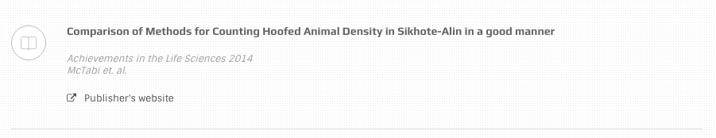
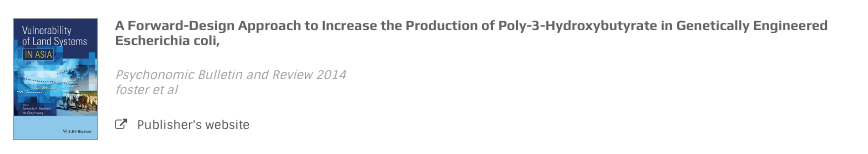

# Pub Item

This element is used to show publications in the template.



**with-icon**

```text
<div class="pub-item with-icon">

  <div class="elem-wrapper"><i class="oli oli-bookmark"></i></div>

  <div class="content-wrapper">
    <h3 class="title">
      <a href="#">A Forward-Design Approach t...</a>
    </h3>
    <div class="description">
      <div class="citation">Achievements in the Life Sciences 2014<br>McTabi et. al.
      </div>
      <a href="#" class="link-with-icon"> <i class="fa fa-external-link"></i>Publisher's website</a>
    </div>
  </div>

</div>
```

 **with-thumb**

```text
<div class="pub-item with-thumb large">

  <div class="elem-wrapper">
    
  </div>

  <div class="content-wrapper">
    <h3 class="title">
      <a href="#">A Forward-Design Approach t...</a>
    </h3>
    <div class="description">
      <div class="citation"><span> <a href="#">Psychonomic Bulletin and Review 2014 </a><span class="block-elem">foster et al</span></span>
      </div>
      <a href="#" class="link-with-icon"><i class="fa fa-external-link"></i>Publisher's website</a>
    </div>
  </div>

 </div>
```

There are variations for thumbnail size \(add to `.with-thumb`\)

* `.xlarge`
* `.large`

