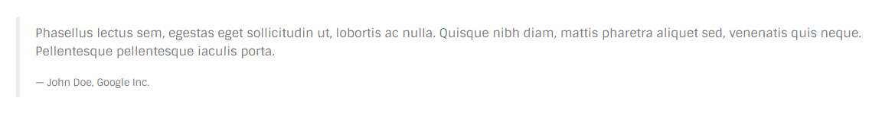

# Quote

## Screenshot


## Markup

```text
<blockquote>
    <p>Phasellus lectus sem, egestas eget sollicitudin ut...</p>
</blockquote>
```

## Variations

### Default

The default variation is shown above.

### With footer



You can add footer to all the variations, as below:

```text
<blockquote>
    <p>Phasellus lectus sem, egestas eget sollicitudin ut...</p>
    <footer>John Doe, Google Inc.</footer>
</blockquote>
```

### With icon


You can achieve this variation using "quote" class:

```text
<blockquote class="quote">
    <p>We believe that DISC-1 is schizophrenia’s Rosetta Stone gene and could...</p>
</blockquote>
```

### Center aligned

Center aligned block quote is achieved using "text-center" class.

