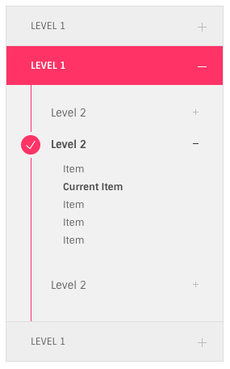

# Sidebar Navigation

## Screenshot



## One Level

```text
<ul class="ol-side-navigation">
  <li>
      <a href="#">level 1</a>
  </li>

  <li class="current-menu-item">
      <a href="#">level 1</a>
  </li>

   ...
</ul>
```

**Notes**

* add `.ol-side-navigation` to a simple list with anchor links
* one `<li>` item can be the current menu item which recieves `.current-menu-item` class

## Adding Second level

```text
<li class="menu-item-has-children">
  <a href="#">level 1</a>
  <ul class="sub-menu">
    <li><a href="#">level 2</a></li>
    <li><a href="#">level 2</a></li>
    <li><a href="#">level 2</a></li>
  </ul>
</li>
```

**Notes**

* add `.menu-item-has-children` class to the `<li>`
* add a `<ul>` with `.sub-menu` class
* The submenu who contains the `.current-menu-item` will recieve `.current-menu-parent`

## Adding Third level

Adding 3'rd levele menu is just like the second menu

## Toggle

It is represented by `.toggle-free` class added to `.ol-side-navigation`

## Skins

* Default : Theme color
* Red : `.red-skin` class
* Green : `.green-skin` class
* Cyan : `.cyan-skin` class
* Yellow : `.yellow-skin` class
* Dark : `.dark-skin` class
* Blue : `.blue-skin` class

