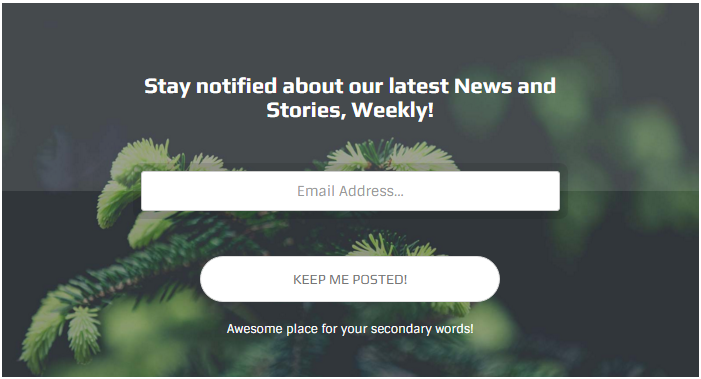
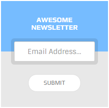

# Newsletter Forms

## screenshot



## Markup

```text
<div class="newsletter-form skin-yellow">
    <div class="nl-title">
        <h3>Stay notified about our latest News and Stories, Weekly!</h3>
    </div>
    <div class="nl-form">
        <div class="form-with-border">
            <input type="text" placeholder="Email Address..." class="form-control">
        </div>
        <input type="submit" value="Keep me posted!" class="btn btn-medium btn-circle btn-block btn-default">
    </div>
</div>
```

## Variations

### With background image

You can set an image to this element like any other element in the theme using "set-bg" class on the element and "set-me" class on the image. Markup would be like:

```text
<div class="newsletter-form set-bg">
    
    <div class="nl-title">
        <h3>Stay notified about our latest News and Stories, Weekly!</h3>
    </div>
    <div class="nl-form">
        <div class="form-with-border">
            <input type="text" placeholder="Email Address..." class="form-control">
        </div>
        <input type="submit" value="Keep me posted!" class="btn btn-medium btn-circle btn-block btn-default">
    </div>
</div>
```

Default color of the text is white to make it dark you can add a "light" class to the element.

### Skins

* Default : theme color
* Blue : "skin-blue" class
* Green : "skin-green" class
* Purple : "skin-purple" class
* Yellow : "skin-yellow" class
* Dark : "skin-dark" class

### size

You can use small forms by adding "small" class to the element.



