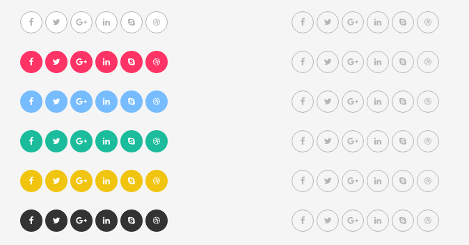

# Social Icons



Social icons are just a list with `.social-icons` class

```text
<ul class="social-icons">
  <li><a href="#"><i class="fa fa-facebook"></i></a></li>
  <li><a href="#"><i class="fa fa-twitter"></i></a></li>
  <li><a href="#"><i class="fa fa-google-plus"></i></a></li>
  <li><a href="#"><i class="fa fa-linkedin"></i></a></li>
  <li><a href="#"><i class="fa fa-skype"></i></a></li>
  <li><a href="#"><i class="fa fa-dribbble"></i></a></li>
</ul>
```

## Size

Three sizes are available that you should add the corresponding class to the `.social-icons` class

* `.size-small` for small ones
* no class for medium ones
* `.size-large` for large ones

## Shape

* `.shape-circle` to make them circle
* `.shape-square` to make them square

## Color Skins

* `.skin-white`
* `.skin-red`
* `.skin-blue`
* `.skin-yellow`
* `.skin-green`
* `.skin-dark`

## Hover color skins

* `.hover-white`
* `.hover-red`
* `.hover-blue`
* `.hover-yellow`
* `.hover-green`
* `.hover-dark`

