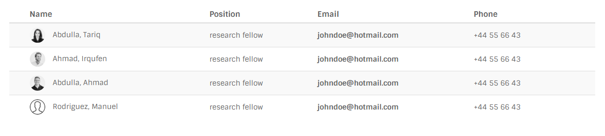

# Tables

## Screenshot



## Markup

```text
<table class="table chaos-table table-striped">
    <thead>
        <tr>
        <th>Name</th>
        <th>Position</th>
        <th>Email</th>
        <th>Phone</th>
    </tr>
    </thead>
    <tbody>
        <tr>
            <td> <a href="#" class="name-avatar">
              <div class="avatar avatar-xs"></div><span class="name">Abdulla, Tariq</span></a></td>
            <td>research fellow</td>
            <td class="bold"><a href="mailto:info@owwwlab.com">johndoe@hotmail.com</a></td>
            <td>+44 55 66 43</td>
        </tr>
        <tr>
            <td> <a href="#" class="name-avatar">
              <div class="avatar avatar-xs"></div><span class="name">Ahmad, Irqufen</span></a></td>
            <td>research fellow</td>
            <td class="bold"><a href="mailto:info@owwwlab.com">johndoe@hotmail.com</a></td>
            <td>+44 55 66 43</td>
        </tr>
        ...
    </tbody>
</table>
```

## Variations

You can also use [bootstrap table](http://getbootstrap.com/css/#tables) variations.

