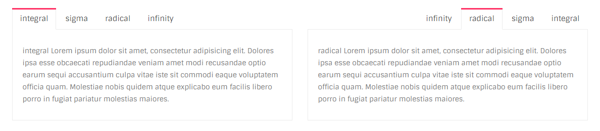
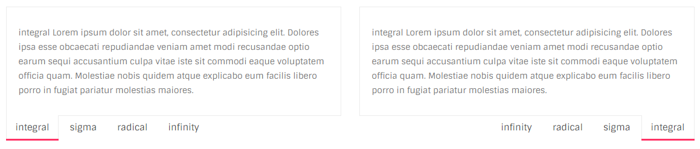
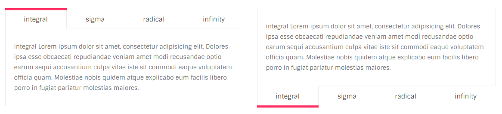
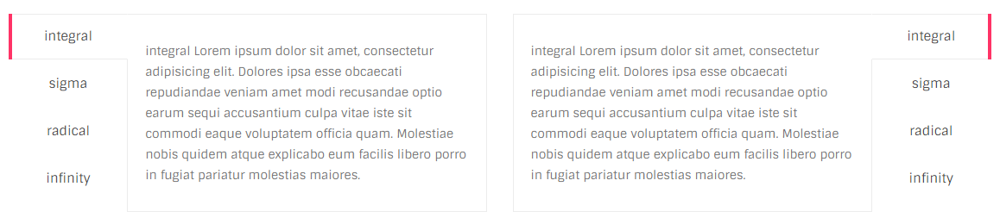

# Tabs

## Screenshot



## HTML

```text
<div class="ol-tab">

  <ul class="tab-navigation">
    <li class="active"><a href="#">integral</a></li>
    <li class=""><a href="#">sigma</a></li>
    <li class=""><a href="#">radical</a></li>
    <li class=""><a href="#">infinity</a></li>
  </ul>

  <div class="tab-content">

    <div class="tab-pane active">
      --- tab contents ---
    </div>

    <div class="tab-pane">
      --- tab contents ---
    </div>

    <div class="tab-pane">
      --- tab contents ---
    </div>

    <div class="tab-pane">
      --- tab contents ---
    </div>

  </div>
</div>
```

## Variations

### Right aligned

It is represented by `ol-tab right` classes.

### Bottom aligned

It is represented by `ol-tab bottom` classes.



### Justified



The class `nav-justified` would be used along with `nav` class:

```text
<div class=`ol-tab`>
    <ul class=`nav nav-tabs nav-justified`>
    ...
</div>
```

### Vertical style

It is represented by `ol-tab vertical` classes.



