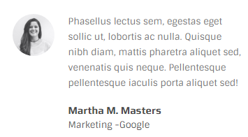
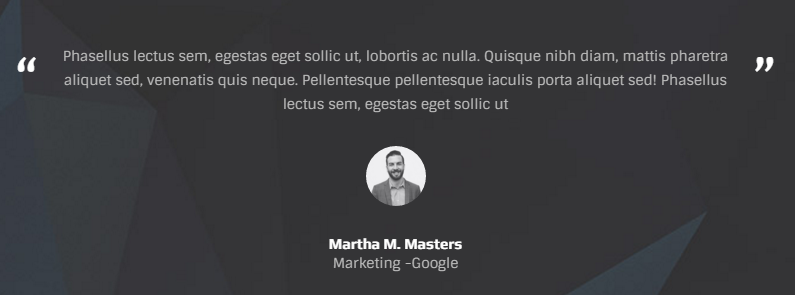

# Testimonials

## screenshot



## HTML

```text
<div class="testimonial-item">
    <div class="avatar avatar-sm">
        
    </div>
    <div class="texts">
        <p>Phasellus lectus sem, egestas eget sollic ut, lobortis ac nulla...</p>
        <h4 class="their-name">Martha M. Masters</h4>
        <div class="their-cite">
            Marketing -<a href="#">Google</a>
        </div>
    </div>
</div>
```

## Variations

Beside the default one shown above you can use another variation of testimonials:



Markup would be:

```text
<div class="testimonial-item">
    <div class="their-quote">
        <p>Phasellus lectus sem, egestas eget sollic ut, lobortis ac nulla...</p>
    </div>
    <div class="their-info">
        <div class="avatar avatar-sm">
            
        </div>
        <h4 class="their-name">Martha M. Masters</h4>
        <div class="their-cite">
            Marketing -<a href="#">Google</a>
        </div>
    </div>
</div>
```

**Note**  
 You can use all the variations in a carousel slider.

