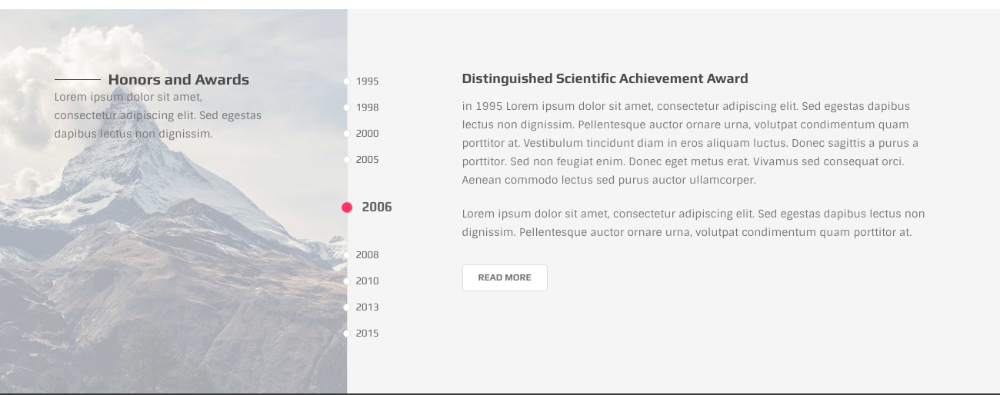

# Time Tab Carousel



Here is the skeleton of the element

```text
<div data-start-from="center" data-fade-edge="true" class="ol-timeline-tab">

  <ul class="tl-head">
    <li>1995</li>
    <li>1998</li>
    <li>2000</li>
    ....
  </ul>

  <div class="tl-content">

  </div>

</div>
```

Each item:

```text
 <div class="tl-item">
  /// your content here
</div>
```

**Note** that the order of `tl-item`s should be the same as coresponding `<li>` at `tl-head` list

