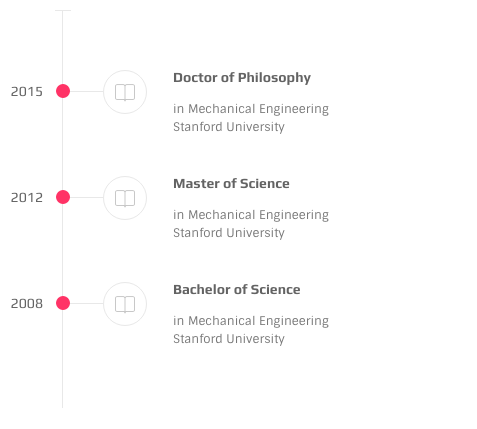
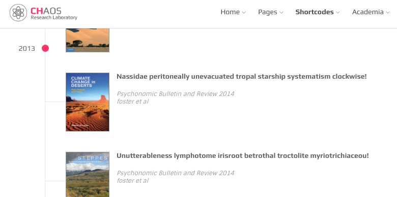

# Timeline

This element is suitable for list contents which are related to each other trough time.

## Screenshot



## HTML

```text
<div class="ol-timeline">

  <div class="tl-item pub-item with-icon">
    <span class="item-section">2015</span>
    <div class="elem-wrapper"><i class="oli oli-bookmark"></i></div>
    <div class="content-wrapper">
      <h3 class="title">Doctor of Philosophy</h3>
      <div class="description">
        <p>in Mechanical Engineering <br> Stanford University</p>
      </div>
    </div>
  </div>

  <div class="tl-item pub-item with-icon">
    <span class="item-section">2012</span>
    <div class="elem-wrapper"><i class="oli oli-bookmark"></i></div>
    <div class="content-wrapper">
      <h3 class="title">Master of Science</h3>
      <div class="description">
        <p>in Mechanical Engineering <br> Stanford University</p>
      </div>
    </div>
  </div>

  <div class="tl-item pub-item with-icon">
    <span class="item-section">2008</span>
    <div class="elem-wrapper"><i class="oli oli-bookmark"></i></div>
    <div class="content-wrapper">
      <h3 class="title">Bachelor of Science</h3>
      <div class="description">
        <p>in Mechanical Engineering <br> Stanford University</p>
      </div>
    </div>
  </div>

</div>
```

* `.ol-timeline` is the wrapper element 
* `.tl-item` is one of timeline items inside the wrapper
* `<span class="item-section">2015</span>` is for the year

## Fixed Scrolling Years



This variation consists of sub-sections, it begins with

```text
<div class="ol-timeline">
  /// sections
</div>
```

Items in each section share the same year, sample of one section:

```text
<div class="tl-section with-icon">
  <div class="tl-item pub-item with-icon">...</div>
  <div class="tl-item pub-item with-icon">...</div>
  <div class="tl-item pub-item with-icon">...</div>
  <span class="item-section">2015</span>
</div>
```

* The year comes at the end of the `.tl-section` 
* use `with-icon` or `with-thumb` classes based on usage 

## `.with-icon` and `.with-thumb` variations

As you may have noticed there are two variation, one which icons at the side of contents and one with thumbnail image. So if your `.pub-item` comes with an icon then you should use the `.with-icon` class and likewise use the `with-thumb` class on `tl-section` class.

