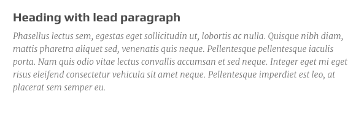
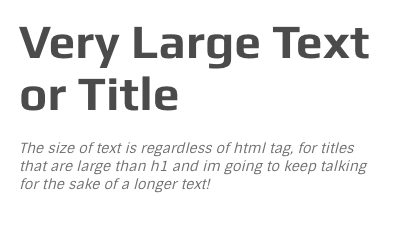
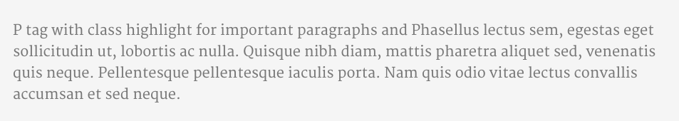
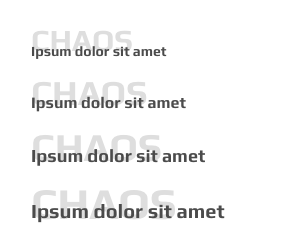

# Headings


```text
<div class="heading-with-sub">
  <h3 class="title">heading with subtitle</h3>
  <h4 class="subtitle">I'm the subtitle, would you please notice me!?</h4>
</div>
```



```text
<div class="heading-with-sub">
  <h3 class="title">heading with lead paragraph</h3>
  <p class="lead">Phasellus lectus sem,...</p>
</div>
```


```text
<div class="heading-with-sub text-center">
  <h2 class="title">larger and centerd for sections</h2>
  <h3 class="subtitle">Heading with sub class suppor..... </h3>
</div>
```


```text
<div class="heading-with-sub">
  <h3 class="title with-sideline">Heading with side line and sub</h3>
  <h4 class="subtitle">I'm sutiable for heading of columns</h4>
</div>
```


```text
<h4 class="with-underline">title with underline</h4>
```



```text
<h3 class="large-text">Very Large Text or Title</h3>
<p class="lead">The size of text is...</p>
```



```text
<p class="highlight">P tag with class highlight for important paragraphs....</p>
```



```text
<h6 class="with-shaded-label"><span class="shaded-label">CHAOS</span>Ipsum dolor sit amet</h6>
<h5 class="with-shaded-label"><span class="shaded-label">CHAOS</span>Ipsum dolor sit amet</h5>
<h4 class="with-shaded-label"><span class="shaded-label">CHAOS</span>Ipsum dolor sit amet</h4>
<h3 class="with-shaded-label"><span class="shaded-label">CHAOS</span>Ipsum dolor sit amet</h3>
<h2 class="with-shaded-label"><span class="shaded-label">CHAOS</span>Ipsum dolor sit amet</h2>
<h1 class="with-shaded-label"><span class="shaded-label">CHAOS</span>Ipsum dolor sit amet</h1>
```

