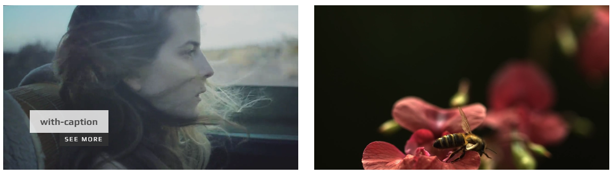

# Video Backgrounds

## screenshot



## HTML

```text
<div class="video-container">
    <div data-src="../../assets/img/video/02/02.mp4" class="owl-videobg autoplay"></div>
</div>
```

## Variations

### autoplay

As you can see above it is achieved using "autoplay" class along with "owl-videobg" class.

### Play on hover

You can use "hoverplay" class instead to achieve this.

### Clickable video

Just wrap the video in anchor tag to achieve this:

```text
<div class="video-container">
    <a href="#">
        <div data-src="../../assets/img/video/01/01.mp4" class="owl-videobg hoverPlay"></div>
    </a>
</div>
```

